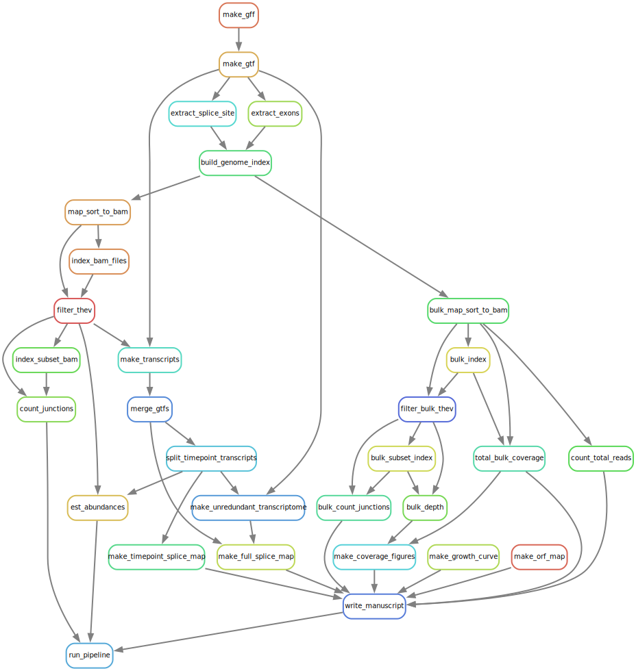

# THEV transcriptome studies

## Background

**Hemorrhagic enteritis (HE)** is a disease affecting 6-12-week-old turkeys characterized by bloody diarrhea, **immunosuppression (IS)**, and up to 60% mortality. This disease is caused by **_Turkey Hemorrhagic Enteritis Virus (THEV)_** of which avirulent strains (THEV-A) that do not cause HE but retain the immunosuppressive ability have been isolated. The THEV-A Virginia Avirulent Strain (VAS) is still used as a live vaccine despite its immunosuppressive properties. **_Our objective is to understand the genetic basis by which VAS brings about IS_**. However, the **transcriptome of THEV** has not been characterized, making the investigation of specific viral genes for possible roles in causing IS impractical as the viral splicing and gene expression patterns are unknown. To identify such viral factors, a well-characterized transcriptome of THEV is required to set the stage for experimentation with specific viral genes that may mediate IS.

## Methods

After infecting a turkey B-cell line (RP-19) with THEV, samples in triplicates were collected at 4-, 12-, 24-, and 72-hours post-infection. Total RNA was subsequently extracted using Thermofishers’s RNAqueous-4PCR Total RNA Isolation Kit, and poly-A-tailed mRNA sequencing done at LC Sciences, Houston TX. The raw sequencing reads were trimmed with the FastQC program, mapped to the THEV genome using Hisat2 and transcripts assembled with StringTie. The `--merge` function of StringTie was used to consolidate transcripts from all timepoints, generating the final THEV transcriptome.

## Data analysis
This project is run from the `Snakefile`. Full analysis pipeline shown below in diagram:

{width=720px height=620px}

## Results

Over 18 million reads mapped to THEV genome providing good coverage/depth, leaving no regions unmapped. All predicted genes in the genome were represented. Interestingly, all were spliced with either with 5’- or 3’-multi exon UTRs hitherto unknown. Thirteen novel exons were identified which require additional verification. The splicing patterns strongly suggest that there are 3 main promoters (E1a-, E3, and major late promoters) driving expression of most of the genes with 2 possible minor promoters driving single genes (ORF7 and ORF8).

We have performed the first RNA-sequencing experiment aimed at characterizing THEV’s transcriptome, which has yielded the only experimentally determined and the most detailed insight of THEV gene expression. In keeping with all Adenoviruses, our data shows that almost all THEV genes are spliced, and under the control of a promoter, several genes are expressed as one transcription unit. This insight of THEV’s transcriptome may allow the engineering of VAS to provide immune protection with less or no associated IS.

### Navigate the project:

```{r include = FALSE}

script_dir <- for(item in list.files("scripts")){
    print(item, quote = FALSE)}

rawfiles_dir <- for(item in list.files("raw_files")){
    print(item, quote = FALSE)}

results_dir <- for(item in list.files("results")){
    print(item, quote = FALSE)
}
```
* **`ROOT (thev_transcriptome)`**
    * **Directories:**
        * *`scripts`*
        * *`raw_files`*
        * *`results`*
        * *`trimmedReads`*
    * **Files**
        * *`Snakefile`*
        * *`driver_script`* - *`deprecated`*
        * *`README.Rmd`*
        * *`project_map.pdf`* 
        * *`project_jobmap.pdf`*
        * *`thev_transcriptome.Rproj`* - *not on Git*
    * **Hidden files**
        * `.gitignore`
        * `.Rproj.user` - *not tracked*
        * `.snakemake` - *not tracked*

### Dependencies:

- `Hisat-2`
- `StringTie`
- `R`
- `Snakemake`
- `zsh shell`
