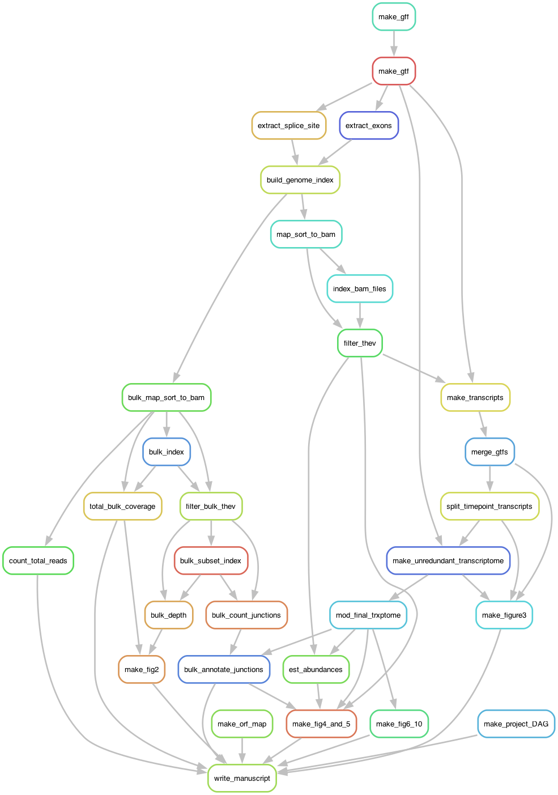

Turkey Hemorrhagic Enteritis Virus transcriptome profiling
================
<strong>Abraham Quaye</strong> 
2023-03-16

## Background

**Hemorrhagic enteritis (HE)** is a disease affecting 6-12-week-old
turkeys characterized by bloody diarrhea, **immunosuppression (IS)**,
and up to 60% mortality. This disease is caused by ***Turkey Hemorrhagic
Enteritis Virus (THEV)*** of which avirulent strains (THEV-A) that do
not cause HE but retain the immunosuppressive ability have been
isolated. The THEV-A Virginia Avirulent Strain (VAS) is still used as a
live vaccine despite its immunosuppressive properties. ***Our objective
is to understand the genetic basis by which VAS brings about IS***.
However, the **transcriptome of THEV** has not been characterized,
making the investigation of specific viral genes for possible roles in
causing IS impractical as the viral splicing and gene expression
patterns are unknown. To identify such viral factors, a
well-characterized transcriptome of THEV is required to set the stage
for experimentation with specific viral genes that may mediate IS.

## Methods

After infecting a turkey B-cell line (RP-19) with THEV, samples in
triplicates were collected at 4-, 12-, 24-, and 72-hours post-infection.
Total RNA was subsequently extracted using Thermofishers’s
`RNAqueous-4PCR Total RNA Isolation Kit`, and poly-A-tailed mRNA
sequencing done at `LC Sciences, Houston TX`. The raw sequencing reads
were trimmed with the `FastQC` program, mapped to the THEV genome using
`Hisat2` and transcripts assembled with `StringTie`. A custom `Rscript`
was used to consolidate all transcripts from all time-points and remove
duplicated features, generating the final THEV transcriptome map.

## Data analysis

This project is run from the `Snakefile`. Full analysis pipeline shown
below in diagram:

## Results

Over 18.1 million reads mapped to THEV genome providing good
coverage/depth, leaving no regions unmapped. The assembled transcripts
fully covered almost all predicted genes in the genome except *33K*,
*22K*, *100K*, and *ORF1*, which were either partially represented or
showed a slightly different CDS due to internal splicing. Interestingly,
all genes were spliced with either with 5’- or 3’-multi exon UTRs
hitherto unknown in THEV, albeit, consistent with *mastadenoviridae*. 35
unique novel exons were identified which require additional
verification. The splicing patterns strongly suggest that there are 4
main promoters (E1a-, E2, E3, and major late promoter \[MLP\]) driving
expression of most of the genes with 1 minor promoter driving the gene,
ORF8.

We have performed the first RNA-sequencing experiment aimed at
characterizing THEV’s transcriptome, which has yielded the only
experimentally determined and the most detailed insight of THEV’s gene
expression map. In keeping with all *Adenoviruses*, our data shows that
all but one (UXP) of THEV genes are spliced, and under the control of a
promoter, several genes are expressed as one transcription unit. Hence,
THEV has four major transcription units, with an extra promoter for
ORF8. This insight of THEV’s transcriptome is essential for elucidating
the functions of individual genes, and may eventually allow the
engineering of VAS to provide immune protection with less or no
associated IS.

### Navigate the project:

- **`ROOT (thev_transcriptome)/`**
  - **Directories:**
    - *`raw_files/`* - Add README for more details
      - `annotations/`
      - `genome_file/`
      - `thevgenome_index/`
    - *`results/`* - Add README for more details
      - `hisat2/`
      - `r/`
      - `sgseq/`
      - `stringtie/`
    - *`scripts/`* - Add README for more details
      - `r/`
      - `README.md/`
      - `zsh/`
    - *`trimmedReads/`* - Add README for more details
      - `forwardTrims/`
      - `reverseTrims/`
      - `uninfected_reads/`
    - *`wet_lab_validation/`* - Add README for more details
      - `all_validation_primers.tsv/`
      - `E4_validation_primers.csv/`
  - **Files**
    - *`environment.yml`*
    - *`LICENSE.md`*
    - *`project_jobmap.svg`*
    - *`project_map.svg`*
    - *`README.md`*
    - *`README.Rmd`*
    - *`thev_transcriptome.Rproj`* - *not on Git*
  - **Hidden files** - *not on Git*
    - *`.DS_Store`*
    - *`.gitignore`*
    - `.git/`
    - `.Rproj.user/`
    - `.snakemake/`

### Dependencies:

- `FastQC`
- `AGAT`
- `Hisat2`
- `StringTie`
- `R version 4.2.3 (2023-03-15)`
- `tidyverse`(v.2.0.0)
- `rmarkdown`(v.2.21)
- `Snakemake`
- `zsh shell`
- See `environment.yml` for `conda env` dependencies
