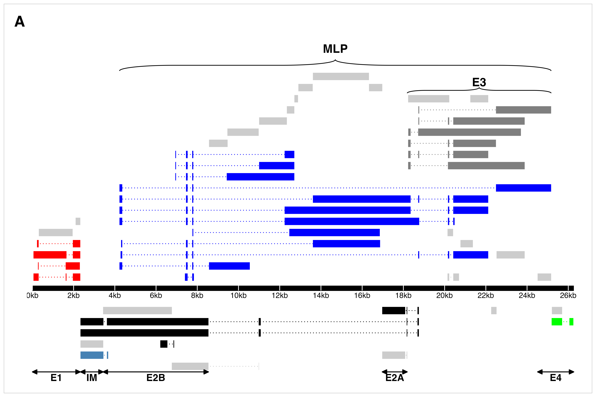
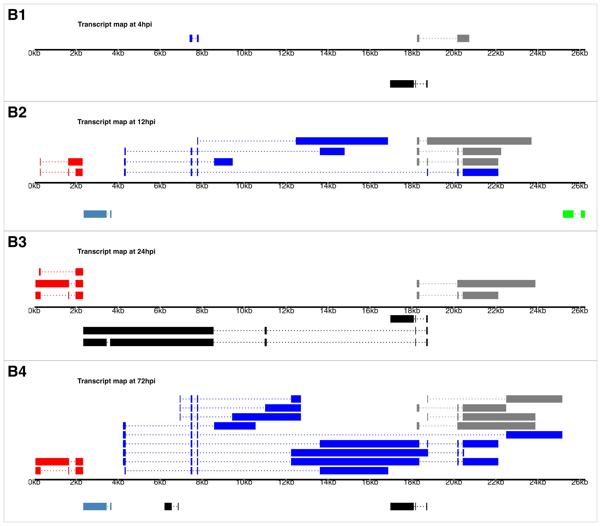

\vspace{5mm}

**Running Title:** Novel Insights into Turkey Hemorrhagic Enteritis Virus Transcriptome

\vspace{10mm}
Abraham Quaye^1\*^, Bret Pickett^\*^, Joel S. Griffitts^\*^, Bradford K. Berges^\*^, Brian D. Poole${^\dagger}$^\*^   

\vspace{5mm}

^\*^Department of Microbiology and Molecular Biology, Brigham Young University       
^1^First-author      
${^\dagger}$ Corresponding Author   

\vspace{5mm}
**Corresponding Author Information**     
[brian_poole@byu.edu](mailto:brian_poole@byu.edu)       
Department of Microbiology and Molecular Biology,       
4007 Life Sciences Building (LSB),    
Brigham Young University,   
Provo, Utah  
\newpage

```{r call_libs, echo=FALSE,include=FALSE, message=FALSE, warning=FALSE}
library(knitr)
library(tidyverse)
library(tibble)
library(scales)
library(gt)
opts_chunk$set(echo = FALSE, message = FALSE, warning = FALSE)

inline_hook <- function(x) {
  if(is.numeric(x)){
    formatted <- format(x, big.mark = ",")
  }else{formatted <- x}
  paste0("**", formatted, "**")
}
knit_hooks$set(inline = inline_hook)
```

```{r inline_values, echo=FALSE,include=FALSE, message=FALSE, warning=FALSE}

# extract paired-end sequencing read length
bam_info <- read_tsv("results/sgseq/bam_extracted_sampleData.tsv",
                     show_col_types = F) 
seq_len <- bam_info %>% select(read_length) %>% slice_head() %>% pull()

## load in variables to be used inline 
source("scripts/r/bam_file_analysis.R")
source("scripts/r/thev_splicing_fullMap.R")


cov_thev <- all_covs %>% filter(organism == "thev")

cov_4hr <- cov_thev %>% filter(timepoint == "4hpi") %>%
              select(total_mapped) %>% pull() %>% as.numeric(.)
cov_72hr <- cov_thev %>% filter(timepoint == "72hpi") %>%
              select(total_mapped) %>% pull() %>% as.numeric(.)
cov_72hr <- round(cov_72hr / 1e6, 1)

total_mapped <- round(sum(as.numeric(cov_thev$total_mapped)) / 1e6, 1)

avg_tot_count <- round(mean(total_reads$total_reads) / 1e6, 1)


### inline code for figure 2: depth graph
dep_4 <- as.numeric(tab1$"4h.p.i"[4])
dep_72 <- as.numeric(str_replace(tab1$"72h.p.i"[4], ",", "")) %>% comma(.)

## inline code of junction stats
tot_jun_4 <- tab1$`4h.p.i`[5]
tot_jun_72 <- tab1$`72h.p.i`[5]
mean_juncreads_4 <- tab1$`4h.p.i`[7]
mean_juncreads_72 <- round(as.numeric(tab1$`72h.p.i`[7]), 1)
max_junread72 <- bulk_junc_stats %>% filter(timepoint == "72hpi") %>%
  pull(read_count) %>% max(.) %>% comma(.)

most_sig_12 <- bulk_junc_stats %>% filter(timepoint == "12hpi", region == "E2") %>% pull(read_count) %>% sum()/as.numeric(tab1$`12h.p.i`[6])*100

most_sig_24 <- bulk_junc_stats %>% filter(timepoint == "24hpi", region == "MLP") %>% pull(read_count) %>% sum()/as.numeric(tab1$`24h.p.i`[6])*100

most_sig_72 <- bulk_junc_stats %>% filter(timepoint == "72hpi", region == "MLP") %>% pull(read_count) %>% sum()/as.numeric(tab1$`72h.p.i`[6])*100
```
## ABSTRACT        
**Background:** Hemorrhagic enteritis (HE) is a disease affecting 6-12-week-old turkeys characterized by _immunosuppression (IS)_ and bloody diarrhea. This disease is caused by _Turkey Hemorrhagic Enteritis Virus (THEV)_ of which avirulent strains (THEV-A) that do not cause HE but retain the immunosuppressive ability have been isolated. The THEV-A Virginia Avirulent Strain (VAS) is still used as a live vaccine despite its immunosuppressive properties. _Our objective is to understand the genetic basis by which VAS induces IS_. The _transcriptome of THEV_ was studied to set the stage for further experimentation with specific viral genes that may mediate IS.      
**Methods:** After infecting a turkey B-cell line (MDTC-RP19) with the VAS vaccine strain, samples in triplicates were collected at 4-, 12-, 24-, and 72-hours post-infection. Total RNA was subsequently extracted, and poly-A-tailed mRNA sequencing done. After trimming the raw sequencing reads with the `FastQC`, reads were mapped to the THEV genome using `Hisat2` and transcripts assembled with `StringTie`. An in-house script was used to consolidate transcripts from all time-points, generating the final transcriptome. PCR, gel electrophoresis, and Sanger sequencing were used to validate all identified splice junctions.      
**Results and Conclusions:** A total of `r total_mapped` million reads mapped to THEV genome providing good coverage/depth, leaving no regions unmapped. All predicted genes in the genome were represented. In keeping with all adenoviruses, all transcripts were spliced with either with 5'- or 3'-multi exon UTRs hitherto unknown. *~~Thirteen~~* novel exons were identified which were validated by PCR and Sanger sequencing. The splicing patterns strongly suggest that there are *~~three~~* main promoters (E1, E3, and major late promoters) driving expression of most of the genes with *~~two~~* possible minor promoters driving single genes (ORF7 and ORF8). This RNA-sequencing experiment is the first study of THEV gene expression to date. In keeping with other Adenoviruses, almost all THEV genes are spliced, and several genes are expressed as one transcription unit under a single promoter. This insight into THEV's transcriptome may allow the engineering of the VAS to provide immune protection with less or no associated IS. 
\newpage

## INTRODUCTION   
Adenoviruses (AdVs) are non-enveloped icosahedral-shaped DNA viruses, causing infection in virtually all vertebrates. Their double-stranded linear DNA genomes range between 26 and 45kb in size, producing a broad repertoire of transcripts via a highly complex alternative splicing pattern [@Davison2003; @Harrach2008]. The AdV genome is one of the most optimally economized; both the forward and reverse DNA strands harbor protein-coding genes, making it highly gene-dense. There are 16 genes termed "genus-common" that are homologous in all AdVs; these are thought to be inherited from a common ancestor. All other genes are termed "genus-specific". "Genus-specific" genes tend to be located at the termini of the genome while "genus-common" genes are usually central [@Davison2003]. This pattern is observed in *Adenoviridae*, *Poxviridae*, and *Herpesviridae* [@Davison2003; @Upton2003; @McGeoch1999]. The family *Adenoviridae* consists of five genera: *Mastadenovirus* (MAdV), *Aviadenovirus*, *Atadenovirus*, *Ichtadenovirus*, and *Siadenovirus* (SiAdV) [@Harrach2011; @Guimet2016]. Currently, there are three recognized members of the genus SiAdV: frog adenovirus 1, raptor adenovirus 1, and turkey adenovirus 3 also called turkey hemorrhagic enteritis virus (THEV) [@Harrach2011; @Kovács2011; @Davison2000; @Kovács2010; @Katoh2009]. Members of SiAdV have the smallest genome size (~26 kb) and gene content (~23 genes) of all known AdVs, and many “genus-specific” putative genes of unknown functions have been annotated (see __Figure 1__)[@Harrach2008; @Kovács2011; @Davison2003].

Virulent strains (THEV-V) and avirulent strains (THEV-A) of THEV are serologically indistinguishable, infecting turkeys, chickens, and pheasants and the THEV-V cause different clinical diseases in these birds [@Harrach2008; @Beach2006]. In turkeys, the THEV-V cause hemorrhagic enteritis (HE), a debilitating acute disease affecting predominantly 6-12-week-old turkeys characterized by immunosuppression (IS), weight loss, intestinal lesions leading to bloody diarrhea, splenomegaly, and up to 80% mortality [@Beach2006; @Beach2009a; @Gross1967]. HE is the most economically significant disease caused by any strain of THEV [@Beach2006]. While the current vaccine strain (a THEV-A isolated from a pheasant, Virginia Avirulent Strain [VAS]) have proven effective at preventing HE in young turkey poults, it still retains the immunosuppressive ability. Thus, vaccinated birds are rendered more susceptible to opportunistic infections and death than unvaccinated cohorts leading to substantial economic losses [@Beach2006; @Rautenschlein2000; @Larsen1985; @Dhama2017]. The induced IS also interferes with vaccination schemes for other infections of turkeys [@Beach2006; @Rautenschlein2000]. To eliminate this immunossupressive side-effect of the vaccine, a thorough investigation of the culprit viral factors (genes) mediating this phenomenon is essential. However, the transcriptome (splicing and gene expression patterns) of THEV has not been characterized, making the investigation of specific viral genes for possible roles in causing IS impractical. A well-characterized transcriptome of THEV is required to enable the next leap forward in THEV research - experimentation with specific viral genes that may mediate IS.

Myriads of studies have elucidated the AdV transcriptome in fine detail [@Donovan2020; @Zhao2014]. However, a large preponderance of studies focus on MAdVs - specifically human AdVs - thus, most of the current knowledge regarding AdV gene expression and replication is based on MAdV studies, which is generalized for all other AdVs [@Guimet2016; @Wolfrum2013]. MAdV genes are transcribed in a temporal manner; therefore, genes are categorized into five early transcription units (E1A, E1B, E2, E3, and E4), two intermediate (IM) units (pIX and IVa2), and one major late unit (MLTU), which generates five families of late mRNAs (L1-L5). An additional gene (UXP or U exon) is located on the reverse strand. The early genes encode non-structural proteins such as enzymes or host cell modulating proteins, primarily involved in DNA replication or providing the necessary intracellular niche for optimal replication while late genes encode structural proteins. The immediate early gene E1A is expressed first, followed by the the delayed early genes, E1B, E2, E3 and E4. Then the intermediate early genes, IVa2 and pIX are expressed followed by the late genes [@Zhao2014; @Donovan2020; @Guimet2016]. MAdV makes an extensive use of alternative RNA splicing to produce a very complex array of mRNAs; all but pIX mRNA undergo at least one splicing event. The MLTU produces over 20 distinct splice variants all of which contain three non-coding exons at the 5'-end (collectively known as the tripartite leader, TPL) [@Donovan2020; @Zhao2014]. There is also an alternate 5' three non-coding exons present in varying amounts on a subset of MLTU mRNAs (known as the x-, y- and z-leaders). Lastly, there is the i-leader exon, which is infrequently included between the second and third TPL exons, and codes for the i-leader protein [@Falvey1983]. Thus, the MLTU produces a complex repertoire of mRNA with diverse 5'-UTRs spliced onto different 3' coding exons which are grouped into five different 3'-end classes (L1-L5). Each transcription unit (TU) contains its own promoter driving the expression of all the array of mRNA transcripts produced via alternative splicing of the genes encoded in the unit[@Zhao2014; @Donovan2020; @Guimet2016]. Almost all AdV mRNAs are generated by the excision of one or more introns and most of these introns are located in the 5' or 3' UTRs of pre-mRNA. Thus the viral introns scarcely interrupt the open reading frames (ORFs) [@Davison2003; @Zhao2014]. 

High throughput sequencing methods have facilitated the discovery of many novel transcribed regions and splicing isoforms. It is also a very powerful tool to study alternative splicing under different conditions at an unparalleled depth [@Djebali2012; @Zhao2014]. In this paper, a paired-end deep sequencing experiment was performed to characterize for the first time, the transcriptome of THEV (VAS vaccine strain) during different phases of the infection, yielding the first THEV splicing map. Our paired-end sequencing allowed for reading `r seq_len` bp long high quality (mean Phred Score of 36) sequences from each end of cDNA fragments, which were mapped to the genome of THEV. The generated data from our paired-end sequencing experiment should thus be reliable.
\newpage

## RESULTS   
**Overview of sequencing data and analysis pipeline outputs**     
A previous study by Zeinab *et al* showed that almost all THEV transcripts were detectable beginning at 4 hours [@Aboezz2019]. Therefore, infected MDTC-RP19 cells were harvested at 4-, 12-, 24-, and 72-hours post-infection(h.p.i) to ensure an amply wide time window to sample all transcripts. Our paired-end RNA sequencing (RNA-seq) experiment yielded an average of `r avg_tot_count` million total reads of `r seq_len`bp in length per time-point, which were simultaneously mapped to both the virus (THEV) and host (*M.gallopavo*) genomes using the `Hisat2` [@Pertea2016] alignment program. A total of `r total_mapped` million reads from all time-points mapped to the virus genome; this provided good coverage/depth, leaving no regions unmapped. The mapped reads to the virus genome increased substantially from `r cov_4hr` reads at 4 h.p.i to `r cov_72hr` million reads at 72 h.p.i (__Table 1__, __Figure 2a__). From the mapped reads, we identified an overall total of `r total_unq_jncs_submit %>% nrow() %>% comma(.)` unique THEV splice junctions from all time-points, with splice junctions from the later time-points being supported by significantly more sequence reads than earlier time-points. For example all the `r tot_jun_4` unique junctions at 4 h.p.i had less than 10 reads supporting each one, averaging a mere `r mean_juncreads_4` reads/junction. Conversely, the `r tot_jun_72` unique junctions at 72 h.p.i averaged `r mean_juncreads_72` reads/junction, some junctions having coverage as high as `r max_junread72` reads. The substantial increases in splice junctions and mapping reads to the THEV genome over time denotes an active infection, and correlates with our qPCR assay quantifying the total number of viral genome copies over time (__Figure 2b__). Using `StringTie` [@Pertea2016], an assembler of RNA-seq alignments into potential transcripts, the mapped reads for each time-point were assembled into transcripts using the genomic location of the predicted THEV ORFs as a guide. In the final consolidated transcriptome of THEV, a composite of all unredundant transcripts from all time points, we counted a total of `r nrow(spliced_gtf)` transcripts all of which are novel. Although some exons in some transcripts match the predicted ORFs exactly, most of our identified exons are longer, spanning multiple predicted ORFs (__Figure 3__). The complete list of unique splice junctions mapped to THEV's genome has been submitted to the National Center for Biotechnology Information Gene Expression Omnibus (http://www.ncbi.nlm.nih.gov/geo) under **accession no. XXXXXX**.

**Changes in THEV splice junction profile over time**   
AdV gene expression occurs under exquisite temporal control, supervised by designated promoters for each transcription unit (TU). Each promoter typically produce one or few pre-mRNAs that undergo alternative splicing to yield the manifold repertoire of complex transcripts characteristic of AdVs. To evaluate the activity of each promoter over time, Firstly, `Ballgown` - a program for statistical analysis of assembled transcriptomes, was used to estimate and normalize expression levels of all transcripts in Fragments Per Kilobase of transcript per Million mapped reads (FPKM) units over time. This revealed DBP - from the E2 region - to be the most significantly expressed at 12 h.p.i, whereas MLP region transcripts were most abundantly expressed at 24 and 72 h.p.i as expected (__Figure 4a__). Also, our analysis of the FPKM values of transcripts by region showed a similar pattern: the E2 region as the most significantly overexpressed at 12 h.p.i, after which the MLP region assumes predominance (__Figure 4b__).
Secondly, we estimated relative abundances of all splice junctions for each time point, counting as significantly expressed only those with coverage of at least 1% of the total splice junction reads counted at the given time point. Very few unique splice junctions and reads were counted at 4 h.p.i; hence, this time point was excluded in this analysis. At 12 h.p.i, `r nrow(sig_12_juncs)` junctions meet the 1% threshold, and were predominantly early region (E1, E2, and E3) junctions, albeit a significant proportion are MLP-derived (__Table 2a__). Junctions from the E2 region were the most abundant at this time point, constituting `r round(most_sig_12, 1)`% of all junctions. The two most abundant junctions at 12 h.p.i were maintained at 24 h.p.i also as the most significantly expressed. However, the MLP-derived junctions were unsurprisingly the most preponderant overall at this time point, accounting for `r round(most_sig_24, 1)`% of all the junction reads counted (__Table 2b__). At 72 h.p.i, the trend of increased activity of the MLP continued as expected; at this time, the MLP-derived junctions was not only the most abundant overall - accounting for `r round(most_sig_72, 1)`% of all junctions reads - but also contained the most significantly expressed individual junctions (__Table 2c__. Also see __Supplementary Tables 1a-c__; __Figure 5a__). When we limited this analysis to only junctions in the final transcriptome, the relative abundances of the junctions for each region over time was substantially similar to the pattern seen with all the junctions included (__Figure 5b__).
Furthermore, we analyzed splice donor and acceptor site nucleotide usage over time to investigate any peculiarities that THEV may show, generally or over the course of the infection. This revealed that, with the exception of one junction (which was a T-G donor-acceptor pair), all splice donor-acceptor pairs in the final transcriptome were the canonical T-A pair.

**Early Region 1 (E1) transcripts**. This region in MAdVs is the first transcribed after successful entry of the viral DNA into the nucleus of the host cell. The host transcription machinery is solely responsible for the transcription of this region. After their translation, the E1 proteins in concert with a myriad of host transcription factors activate the other viral promoters [@Guimet2016]. We discovered four novel transcripts in this region with varying protein-coding potential (PCP).

~~and also validated the predicted ORF (sialidase; ORF1)~~.

Early Region 2A (E2A) transcripts.

Early Region 2B (E2B) transcripts.

Early Region 3 (E3) transcripts.

Early Region 4 (E4) transcripts.

Intermediate Region (IM) transcripts.

Major Late Promoter Region (MLP) transcripts.

\newpage

## MATERIALS AND METHODS   
### Cell culture and THEV Infection   
The Turkey B-cell line (MDTC-RP19, ATCC CRL-8135) was grown as suspension cultures in 1:1 complete Leibovitz's L-15/McCoy's 5A medium with 10% fetal bovine serum (FBS), 20% chicken serum (ChS), 5% tryptose phosphate broth (TPB), and 1% antibiotics solution (100 U/mL Penicillin and 100ug/mL Streptomycin), at 41^o^C in a humidified atmosphere with 5% CO~2~. Infected cells were maintained in 1:1 serum-reduced Leibovitz's L15/McCoy's 5A media (SRLM) with 2.5% FBS, 5% ChS, 1.2% TPB, and  1% antibiotics solution (100 U/mL Penicillin and 100ug/mL Streptomycin). A commercially available HE vaccine was purchased from Hygieia Biological Labs as a source of THEV-A (VAS strain). The stock virus was titrated using an in-house qPCR assay with titer expressed as genome copy number(GCN)/mL, similar to Mahshoub *et al*[@Mahsoub2017] with modifications. Cells were infected at a multiplicity of infection (MOI) of 100 GCN/cell and samples in triplicates were harvested at 4-, 12-, 24-, and 72-h.p.i for RNA-seq. The infection was repeated but samples in triplicates were harvested at 12-, 24-, 36-, 48-, and 72-h.p.i for PCR validation of novel splice sites.

### RNA extraction and Sequencing   
Total RNA was extracted from infected cells using Thermofishers' RNAqueous™-4PCR Total RNA Isolation Kit `(#AM1914)` as per manufacturer's instructions. An agarose gel electrophoresis was performed to check RNA integrity. The RNA quantity and purity was initially assessed using `nanodrop`, and RNA was used only if the A260/A280 ratio was 2.0 ± 0.05 and the A260/A230 ratio was >2 and <2.2. Extracted total RNA samples were sent to `LC Sciences, Houston TX` for poly-A-tailed mRNA sequencing where RNA integrity was checked with `Agilent Technologies 2100 Bioanalyzer High Sensitivity DNA Chip` and poly(A) RNA-seq library was prepared following `Illumina's TruSeq-stranded-mRNA sample preparation protocol`. Paired-end sequencing was performed on `Illumina's NovaSeq 6000 sequencing system`.

### Computational Analysis of RNA Sequencing Data: Mapping and Transcript characterization
Analysis of our sequence reads were analyzed following a well established protocol described by Pertea _et al_ [@Pertea2016], using `SNAKEMAKE 7.24.0` to drive the pipeline. Briefly, sequencing reads were trimmed with the `FastQC - version 0.11.9` [@FastQC] program to achieve an overall `Mean Sequence Quality (Phred Score)` of 36. Trimmed reads were mapped to the complete sequence of avirulent turkey hemorrhagic enteritis virus strain Virginia (https://www.ncbi.nlm.nih.gov/nuccore/AY849321.1/) and *Meleagris gallopavo* (https://www.ncbi.nlm.nih.gov/genome/?term=Meleagris+gallopavo) using `Hisat2 - version 2.2.1` [@Pertea2016] with default settings without relying on known splice sites. The generated `BAM` files from each infection time-point were filtered for reads mapping to the THEV genome and fed into `StringTie - version 2.2.1` [@Pertea2016] using a `gff3` file from NCBI containing the predicted ORFs of THEV as a guide. A custom script was used to consolidate all transcripts from all time-points without redundancy, generating the final transcriptome of THEV.

### Validation of Novel Splice Junctions 
All splice junctions identified in this work are novel except one predicted splice site each for pTP and DBP, which were corroborated in our work. However, these predicted splice junctions have not been experimentally validated hitherto, and we identified additional novel splice junctions beside the predicted junctions, giving a more complete picture of the transcripts.

The novel splice junctions after consolidating all transcripts with `StringTie` which we validated by PCR and Sanger Sequencing are shown in ~~Table###1~~. We designed primers that crossed a range of novel exon–exon boundaries for each specific transcript in a transcription unit with their respective universal primers (~~supplementary, PCR methods~~). Each forward primer contained a KpnI restriction site and reverse primers, an XbaI site. After first-strand cDNA synthesis with SuperScript™ III First-Strand Synthesis System (ThermoFisher SCIENTIFIC), these primers were used in a targeted PCR experiment, the PCR products were analysed on Agarose gels, cloned by traditional restriction enzyme method and Sanger sequenced to validate these splice junctions at the sequence level.

### 3' Rapid Amplification of cDNA Ends (3'RACE)  

\newpage

## DISCUSSION/CONCLUSIONS

\newpage

## SCRIPTS AND SUPPLEMENTARY MATERIALS    

### DATA AVAILABILITY    

### CODE AVAILABILITY    
All the code/scripts written for analysis of the data is available on github (linkXXXXXX)
\newpage

## ACKNOWLEDGMENTS  
LC Sciences
`Eton Bioscience, Inc, San Diego, CA`
\newpage

## REFERENCES     
\setlength{\parindent}{-0.25in}
\setlength{\leftskip}{0.25in}
\noindent
<div id="refs"></div>
\setlength{\parindent}{0in}
\setlength{\leftskip}{0in}
\newpage

## TABLES AND FIGURES     

**Figure 1. _Genomic map of THEV avirulent strain_**. The central horizontal line represents the double-stranded DNA marked at 5kb intervals as white line breaks. Blocks represent viral genes. Blocks above the DNA line are transcribed rightward, those below are transcribed leftward. pTP, DBP and 33K predicted to be spliced are shown as having tails. Shaded regions indicate regions containing "genus-specific" genes (colored red). Genes colored in blue are "genus-common".  Gene colored in light green is conserved in all but Atadenoviruses. The UXP (light blue) is an incomplete gene present in almost all AdVs. Regions comprising the different transcription units are labelled at the bottom (E1, E2A, E2B, E3, E4, and IM); the unlabeled regions comprise the MLTU.

```{r}
gt(tab1) %>%
  fmt_markdown()
```


**Figure 2. a) _Per base coverage of sequence reads mapping to THEV genome by time point_**. The pileup of mRNA reads mapping to THEV genome at the base-pair level for each indicated time point show remarkable difference in terms of quantities. There is a dramatic increase of mean coverage/depth from `r dep_4` at 4 h.p.i to `r dep_72` at 72 h.p.i, strongly demonstrating an active infection. Unexpectedly, the pileup of reads seems consistently skewed over similar regions of the genome. We could speculate that the temporal gene expression regulation of THEV is different from MAdVs or this could simply mean that the infection was not well synchronized. However, the relative proportions over these similar regions shows some variation over time. **b) _One-step growth of THEV (VAS vaccine strain) in MDTC-RP19 cell line_**. After infecting cells at an MOI of 100 GCN/cell, triplicates of harvested infected cells were quantified with an in-house qPCR assay measuring the total copies of THEV genome. There is no discernible increase in virus titer up 12 h.p.i, after which there is a steady increase in virus titer is measured. The virus titer expands exponentially beginning from 48 h.p.i, increasing by orders of magnitude before reaching a plateau at 120 h.p.i, probably due to high cell death. GCN: genome copy number.



**Figure 3. a) __Full transcriptome of THEV__**. THEV transcripts assembled from all time points by `StringTie` are unified forming this final transcriptome (splicing map). Transcripts belonging to the same transcription unit (TU) are located in close proximity on the genome and are color coded and labeled in this figure as such. The organization of TUs in the THEV genome is unsurprisingly similar to MAdVs; however, the MAdV genome shows significantly more transcripts. The TUs are color coded: E1 transcripts - red, E2 - black, E3 - dark grey, E4 - green, MLP - blue. Predicted ORFs are also indicated here, colored light grey. **b) __THEV transcripts identified at given time points__**. Transcripts are color coded as explained in **a**. 

**Table 2A**

```{r}
gt(sig_12_juncs)
```

**Table 2B**

```{r}
gt(sig_24_juncs)
```

**Table 2C**

```{r}
gt(sig_72_juncs)
```


**Figure 4 Overview of change in expression of THEV transcripts over time.** 
**a)** 
**b)**


**Figure 5. a) Relative abundances of splice junctions over time as a proxy of estimating activity levels of THEV promoters**. ## Description here ##########. **b) Relative abundances of junctions in final transcriptome**. ##Description here #######.


