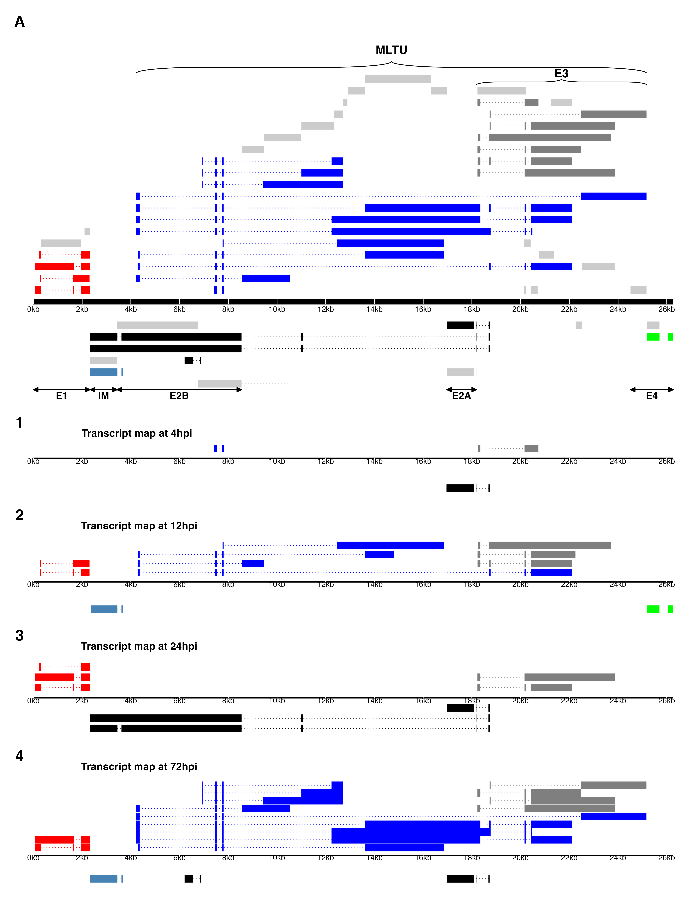

\vspace{5mm}

**Running Title:** Novel Insights into Turkey Hemorrhagic Enteritis Virus Transcriptome

\vspace{10mm}

Abraham Quaye^1\*^, Brett Pickett^\*^, Joel S. Griffitts^\*^, Bradford K. Berges^\*^, Brian D. Poole${^\dagger}$^\*^

\vspace{5mm}

^\*^Department of Microbiology and Molecular Biology, Brigham Young University\
^1^First-author\
${^\dagger}$ Corresponding Author

\vspace{5mm}

**Corresponding Author Information**\
[brian_poole\@byu.edu](mailto:brian_poole@byu.edu)\
Department of Microbiology and Molecular Biology,\
4007 Life Sciences Building (LSB),\
Brigham Young University,\
Provo, Utah\
\newpage

```{r call_libs, echo=FALSE,include=FALSE, message=FALSE, warning=FALSE}
library(knitr)
library(tidyverse)
library(tibble)
library(scales)
library(flextable)
library(english)
library(rticles)
opts_chunk$set(echo = FALSE, message = FALSE, warning = FALSE)
knitr::opts_chunk$set(tab.cap.pre = "", tab.cap.sep = "")

inline_hook <- function(x) {
  if(is.numeric(x)){
    formatted <- format(x, big.mark = ",")
  }else{formatted <- x}
  paste0("**", formatted, "**")
}
knit_hooks$set(inline = inline_hook)
```

```{r inline_values, echo=FALSE,include=FALSE, message=FALSE, warning=FALSE}

# extract paired-end sequencing read length
bam_info <- read_tsv("results/sgseq/bam_extracted_sampleData.tsv",
                     show_col_types = F) 
seq_len <- bam_info %>% select(read_length) %>% slice_head() %>% pull()


## load in variables to be used inline 
source("scripts/r/bam_file_analysis.R")
source("scripts/r/thev_splicing_fullMap.R")
source("scripts/r/abundance_analyses.R")
source("scripts/r/reg_by_reg_plots.R")


cov_thev <- all_covs %>% filter(organism == "thev")

cov_4hr <- cov_thev %>% filter(timepoint == "4hpi") %>%
              select(total_mapped) %>% pull() %>% as.numeric(.)
cov_72hr <- cov_thev %>% filter(timepoint == "72hpi") %>%
              select(total_mapped) %>% pull() %>% as.numeric(.)
cov_72hr <- round(cov_72hr / 1e6, 1)

total_mapped <- round(sum(as.numeric(cov_thev$total_mapped)) / 1e6, 1)

avg_tot_count <- round(mean(total_reads$total_reads) / 1e6, 1)


### inline code for figure 2: depth graph
dep_4 <- as.numeric(tab1$"4h.p.i"[4])
dep_72 <- as.numeric(str_replace(tab1$"72h.p.i"[4], ",", "")) %>% comma(.)

## inline code of junction stats
tot_jun_4 <- tab1$`4h.p.i`[5]
tot_jun_72 <- as.character(tab1$`72h.p.i`[5])
mean_juncreads_4 <- tab1$`4h.p.i`[7]
mean_juncreads_72 <- round(as.numeric(tab1$`72h.p.i`[7]), 1)
max_junread72 <- bulk_junc_stats %>% filter(timepoint == "72hpi") %>%
  pull(read_count) %>% max(.) %>% comma(.)

most_sig_12 <- bulk_junc_stats %>% filter(timepoint == "12hpi", region == "MLP") %>% pull(read_count) %>% sum()/as.numeric(tab1$`12h.p.i`[6])*100

most_sig_24 <- bulk_junc_stats %>% filter(timepoint == "24hpi", region == "MLP") %>% pull(read_count) %>% sum()/as.numeric(str_remove(tab1$`24h.p.i`[6], ","))*100

most_sig_72 <- bulk_junc_stats %>% filter(timepoint == "72hpi", region == "MLP") %>% pull(read_count) %>% sum()/as.numeric(tab1$`72h.p.i`[6])*100
```

## ABSTRACT

We have performed an RNA-sequencing experiment characterizing the transcriptome of turkey hemorrhagic enteritis virus (THEV) for the first time, yielding the only insight into THEV's gene expression patterns. Previously, THEV's genome had been predicted to encode 23 open reading frames (ORFs). In this work we identified 29 transcripts from our RNA-seq data all of which consisted of novel exons albeit some exons matched the predicted ORFs. The three predicted splice junctions were also corroborated by our data. We performed PCR amplification of THEV cDNA and cloned the PCR products, and Sanger sequencing was used to validate all identified splice junctions. During validation, we identified 5 additional transcripts some of which were further validated by 3'RACE data. Thus, the transcriptome of THEV consists of 34 unique transcripts with the coding capacity for all predicted ORFs. However, we found 6 predicted ORFs (ORF1, E3, 33K, ORF8, IVa2, and protease) to be truncated predictions as either an in-frame upstream start codon was identified or additional coding exons were found. We also identified 3 predicted ORFs with longer or shorter isoforms, and 7 novel unpredicted ORFs that could be encoded by some transcripts; albeit it is beyond the scope of this manuscript to investigate whether they get translated. Similar to other adenoviruses, THEV also produce multiple distinctly spliced transcripts that code for the same protein across its genome. Also, our data shows that all THEV transcripts are spliced, and organized in five transcription units under the control of their cognate promoter. However, our data suggests that THEV's temporal regulation may be different from other adenoviruses. Over 2,300 unique splice junctions were found across the genome, mostly at low levels. This low-level use of broad alternative splicing patterns is thought to enable the virus to maximize its coding potential in an evolving environment. 
\newpage

## INTRODUCTION

Adenoviruses (AdVs) are non-enveloped icosahedral-shaped DNA viruses, causing infection in virtually all vertebrates. Their double-stranded linear DNA genomes range between 26 and 45kb in size, producing a broad repertoire of transcripts via highly complex alternative splicing patterns [@Davison2003; @Harrach2008]. The AdV genome is one of the most optimally economized; both the forward and reverse DNA strands harbor protein-coding genes, making it highly gene-dense. There are 16 genes termed "genus-common" that are homologous in all AdVs; these are thought to be inherited from a common ancestor. All other genes are termed "genus-specific". "Genus-specific" genes tend to be located at the termini of the genome while "genus-common" genes are usually central [@Davison2003]. This pattern is observed in *Adenoviridae*, *Poxviridae*, and *Herpesviridae* [@Davison2003; @Upton2003; @McGeoch1999]. The family *Adenoviridae* consists of five genera: *Mastadenovirus* (MAdV), *Aviadenovirus*, *Atadenovirus*, *Ichtadenovirus*, and *Siadenovirus* (SiAdV) [@Harrach2011; @Guimet2016]. Currently, there are three recognized members of the genus SiAdV: frog adenovirus 1, raptor adenovirus 1, and turkey adenovirus 3 also called turkey hemorrhagic enteritis virus (THEV) [@Harrach2011; @Kovács2011; @Davison2000; @Kovács2010; @Katoh2009]. Members of SiAdV have the smallest genome size (\~26 kb) and gene content (\~23 genes) of all known AdVs, and many "genus-specific" putative genes of unknown functions have been annotated (see **Figure 1**)[@Harrach2008; @Kovács2011; @Davison2003].

Virulent THEV strains (THEV-V) and avirulent strains (THEV-A) of THEV are serologically indistinguishable, infecting turkeys, chickens, and pheasants, with the THEV-V causing different clinical diseases in these birds [@Harrach2008; @Beach2006]. In turkeys, the THEV-V cause hemorrhagic enteritis (HE), a debilitating acute disease affecting predominantly 6-12-week-old turkeys characterized by immunosuppression (IS), weight loss, intestinal lesions leading to bloody diarrhea, splenomegaly, and up to 80% mortality [@Beach2006; @Beach2009a; @Gross1967]. HE is the most economically significant disease caused by any strain of THEV [@Beach2006]. While the current vaccine strain (a THEV-A isolated from a pheasant, Virginia Avirulent Strain [VAS]) has proven effective at preventing HE in young turkey poults, it still retains the immunosuppressive ability. Thus, vaccinated birds are rendered more susceptible to opportunistic infections and death than unvaccinated cohorts leading to substantial economic losses [@Beach2006; @Rautenschlein2000; @Larsen1985; @Dhama2017]. To eliminate this immunossupressive side-effect of the vaccine, a thorough investigation of the culprit viral factors (genes) mediating this phenomenon is essential. However, the transcriptome (splicing and gene expression patterns) of THEV has not been characterized, making the investigation of specific viral genes for possible roles in causing IS impractical. A well-characterized transcriptome of THEV is required to enable experimentation with specific viral genes that may mediate IS.

Myriads of studies have elucidated the AdV transcriptome in fine detail [@Donovan2020; @Zhao2014]. However, a large preponderance of studies focus on MAdVs -- specifically human AdVs. Thus, most of the current knowledge regarding AdV gene expression and replication is based on MAdV studies, which is generalized for all other AdVs [@Guimet2016; @Wolfrum2013]. MAdV genes are transcribed in a temporal manner; therefore, genes are categorized into five early transcription units (E1A, E1B, E2, E3, and E4), two intermediate (IM) units (pIX and IVa2), and one major late unit (MLTU or major late promoter [MLP] region), which generates five families of late mRNAs (L1-L5) based on the polyadenylation site. An additional gene (UXP or U exon) is located on the reverse strand. The early genes encode non-structural proteins such as enzymes or host cell modulating proteins, primarily involved in DNA replication, or providing the necessary intracellular niche for optimal replication while late genes encode structural proteins that act as capsid proteins, promote virion assembly, and direct genome packaging. The immediate early gene E1A is expressed first, followed by the the delayed early genes, E1B, E2, E3 and E4. Then the intermediate early genes, IVa2 and pIX are expressed followed by the late genes [@Zhao2014; @Donovan2020; @Guimet2016]. Noteworthily, the MLP shows basal transcriptional activity during early infection (before DNA replication), with a comparable efficiency to other early viral promoters, but reaches its maximal activity during late infection (after DNA replication). However, during early infection the repertoire of late transcripts from the MLP is restricted until late infection [@Guimet2016]. MAdV makes an extensive use of alternative RNA splicing to produce a very complex array of mRNAs. All but the pIX mRNA undergo at least one splicing event. For instance, the MLTU produces over 20 distinct splice variants all of which contain three non-coding exons at the 5'-end (collectively known as the tripartite leader, TPL) [@Donovan2020; @Zhao2014]. There is also an alternate 5' three non-coding exons present in varying amounts on a subset of MLTU mRNAs (known as the x-, y- and z-leaders). Lastly, there is the i-leader exon, which is infrequently included between the second and third TPL exons, and codes for the i-leader protein [@Falvey1983]. Thus, the MLTU produces a complex repertoire of mRNA with diverse 5' untranslated regions (UTRs) spliced onto different 3' coding exons which are grouped into five different 3'-end classes (L1-L5) based on polyadenylation site. Each transcription unit (TU) contains its own promoter driving the expression of all the array of mRNA transcripts produced via alternative splicing in the unit [@Zhao2014; @Donovan2020; @Guimet2016]. The promoters are activated at different phases of the infection by proteins from previously activated TUs. Paradoxically, the early-to-late phase transition during infection requires the L4 genes, 22K and 33K, which should only be available after the transition. However, a promoter in the L4 region (L4P) that directs the expression of these two proteins independent of the MLP was found, resolving the paradox [@Morris2010; @Guimet2016; @Donovan2020]. During translation of AdV mRNA, recent studies strongly suggest the potential usage of secondary start codons; adding to what was already a highly complex system for gene expression [@Donovan2020; @Westergren2021].

High throughput sequencing methods have facilitated the discovery of many novel transcribed regions and splicing isoforms. It is also a very powerful tool to study alternative splicing under different conditions at an unparalleled depth [@Djebali2012; @Zhao2014; Westergren2021]. In this paper, a paired-end deep sequencing experiment was performed to characterize for the first time the transcriptome of THEV (VAS vaccine strain) during different phases of the infection, yielding the first THEV splicing map. Our paired-end sequencing allowed for reading `r seq_len` bp long high quality (mean Phred Score of 36) sequences from each end of cDNA fragments, which were mapped to the genome of THEV.
\newpage

## RESULTS

**Overview of sequencing data and analysis pipeline outputs**  
A previous study by Aboezz *et al* showed that almost all THEV transcripts were detectable beginning at 4 hours [@Aboezz2019]. Therefore, infected MDTC-RP19 cells were harvested at 4-, 12-, 24-, and 72-hours post-infection (h.p.i) to ensure an amply wide time window to sample all transcripts. Our paired-end RNA sequencing (RNA-seq) experiment yielded an average of `r avg_tot_count` million total reads of `r seq_len`bp in length per time-point, which were simultaneously mapped to both the virus (THEV) and host (*Meleagris gallopavo*) genomes using the `Hisat2` [@Pertea2016] alignment program. A total of `r total_mapped` million reads from all time-points mapped to the virus genome; this provided good coverage/depth, leaving no regions unmapped. The mapped reads to the virus genome increased substantially from `r cov_4hr` reads at 4 h.p.i to `r cov_72hr` million reads at 72 h.p.i (**Table 1**, **Figure 2a**). From the mapped reads, we identified a total of `r total_unq_jncs_submit %>% nrow() %>% comma(.)` unique THEV splice junctions from all time-points, with splice junctions from the later time-points being supported by significantly more sequence reads than earlier time-points. For example, all the `r tot_jun_4` unique junctions at 4 h.p.i had less than 10 reads supporting each one, averaging a mere `r mean_juncreads_4` reads/junction. Conversely, the `r tot_jun_72` unique junctions at 72 h.p.i averaged `r mean_juncreads_72` reads/junction, some junctions having coverage as high as `r max_junread72` reads. The substantial increases in splice junction and mapping reads to the THEV genome over time denotes an active infection and correlates with our quantitative PCR (qPCR) assay quantifying the total number of viral genome copies over time (**Figure 2b**). 

Using `StringTie` [@Pertea2016], an assembler of RNA-seq alignments into potential transcripts, the mapped reads for each time point were assembled into transcripts using the genomic location of the predicted THEV ORFs as a guide. In the consolidated transcriptome, a composite of all unredundant transcripts from all time points, we counted a total of `r nrow(spliced_gtf)-1` novel transcripts. Although some exons in some transcripts match the predicted ORFs exactly, most of our identified exons are longer, spanning multiple predicted ORFs (**Figure 3**).

We validated the splice junctions in all transcripts by PCR amplification of viral cDNA, cloning, and Sanger sequencing (**Supplementary PCR methods**). During validation, we identified 5 additional transcripts some of which were further validated by 3' Rapid Amplification of cDNA Ends (3'RACE) data. The complete list of unique splice junctions mapped to THEV's genome has been submitted to the National Center for Biotechnology Information Gene Expression Omnibus (<http://www.ncbi.nlm.nih.gov/geo>) under accession number GSE254416.

**Changes in THEV splicing profile over time**\
AdV gene expression occurs under exquisite temporal control with each promoter typically producing one or few pre-mRNAs that undergo alternative splicing to yield the manifold repertoire of complex transcripts. To evaluate the activity of each promoter over time, `StringTie` and `Ballgown` (a program for statistical analysis of assembled transcriptomes) [@Ballgown] were used to estimate the normalized expression levels of all transcripts for each time point in Fragments Per Kilobase of transcript per Million mapped reads (FPKM) units. Very few unique splice junctions, reads, and transcripts were counted at 4 h.p.i; hence, this time point was excluded in this analysis.

```{r temporal transcript expression levels}
abn_each_12 <- t_expr_each %>% filter(trxpt_id == "E2: TRXPT_21", timepoint == "12h.p.i") %>% pull(fpkm_trxpt_percent)
```

Considering individual mRNAs, TRXPT_21 -- from the E2 region -- was the most significantly expressed at 12 h.p.i, constituting about `r abn_each_12`% of the total expression of all transcripts. Transcripts in the E3 and E4 regions also contributed significant proportions, and noticeably, some MLP region transcripts. The later time points were dominated by the MLP region transcripts -- TRXPT_10 and TRXPT_14 were the most abundantly expressed at 24 and 72 h.p.i, respectively, as expected (**Figure 4a**). When we performed analysis of the FPKM values of transcripts per region we found a similar pattern: the E2 region was the most abundantly expressed at 12 h.p.i, after which the MLP region assumes predominance (**Figure 4b**). Secondly, we estimated relative abundances of all splice junctions at each time point using the raw reads. For individual junctions, we counted as significantly expressed only junctions with coverage of at least 1% of the total splice junction reads at the given time point. At 12 h.p.i, `r nrow(sig_12_juncs)` junctions meet the 1% threshold, and were comprised of predominantly early region (E1, E2, E3, and E4) junctions, albeit the MLTU was the single most preponderant region overall, constituting `r round(most_sig_12, 1)`% of all the junction reads (**Table 2a** and **Supplementary Table 1a**). The topmost abundant junctions at 12 h.p.i remained the most significantly expressed at 24 h.p.i also. However, here, the MLP-derived junctions were unsurprisingly even more preponderant overall, accounting for `r round(most_sig_24, 1)`% of all the junction reads counted (**Table 2b** and **Supplementary Table 1b**). At 72 h.p.i, the trend of increased activity of the MLP continued as expected; at this time, the MLP region junctions were not only the most abundant overall -- accounting for `r round(most_sig_72, 1)`% of all junction reads, -- but also contained the most significantly expressed individual junctions (**Table 2c**, **Supplementary Table 1c** and **Figure 4c**). When we limited this analysis to only junctions in the final transcriptome, the relative abundances of the junctions for each region over time was generally similar to the pattern seen with all the junctions included (**Figure 4d**).   

We also analyzed splice donor and acceptor site nucleotide usage over time to investigate any peculiarities that THEV may show, generally or over the course of the infection. We found that most splice donor-acceptor sequences were unsurprisingly the canonical GT-AG nucleotides. However, the splice acceptor-donor pairing became less specific over time, such that all combinations of nucleotide pairs were eventually detected (**Figure 5**)

**Early Region 1 (E1) transcripts**    
This region in MAdVs is the first transcribed after successful entry of the viral DNA into the host cell nucleus, albeit at low levels [@Zhao2014]. The host transcription machinery solely mediates the transcription of this region. After their translation, the E1 proteins in concert with a myriad of host transcription factors activate the other viral promoters [@Guimet2016]. In MAdVs, this region is subdivided into E1a and E2b units, but the transcripts found in our data categorized under this region do not appear to so divided.

Only two ORFs (ORF1 [sialidase] and Hyd) are predicted in this region; however, we discovered `r as.character(english(nrow(filter(spliced_gtf, region == "E1"))))` novel transcripts in this region, which collectively contain `r nrow(reg_e1_brkdown)` unique splice junctions (**Figure 6**). Most of the ORFs of the novel transcripts are distinct from the predicted ORFs, but they all have the coding potential (CP) for the predicted Hyd protein as the 3'-most coding sequence (CDS) if secondary start codon usage is considered as reported for other AdVs [@Donovan2020; @Zhao2014]. The 5'-most CDS of TRXPT_1 is multi-exonic, encoding a novel 17.9 kilodalton (kDa), 160 residue [amino acids (aa)] protein (ORF9). From its 5'-most start codon (SSC), TRXPT_2 encodes the largest protein in this region -- a 64.3 kDa, 580 aa protein (ORF10) with the same SSC as ORF9 (position 211bp). ORF10 spans almost the entire predicted ORF1 and Hyd, coming short in two regards: it is spliced from 1655bp to 1964bp (ORF1's C-terminus, including the stop codon), and it's stop codon (STC; position 2312) is 13 bp short of Hyd's STC. However, it has an SSC 102 bp upstream and in-frame with ORF1's predicted SSC. Thus, ORF10 shares substantial protein sequence similarity with ORF1 but not with Hyd, as the SSC of Hyd is not in-frame. Without its splice site removing the ORF1 STC, TRXPT_2 would encode a longer variant of ORF1, starting from an upstream SSC. TRXPT_3 is almost identical to TRXPT_1, except for the lack of TRXPT_1's second exon. Our RNA-seq data shows that all E1 transcripts share the same transcription termination site (TTS; at position 2325bp). However, TRXPT_3 and TRXPT_4 seem to have transcription start sites (TSS) downstream of the TSS of TRXPT_1 and TRXPT_2 (E1 TSS; position: 54bp). Given that studies in MAdVs show that E1 mRNAs share not only a common TTS but also the TSS, and only differ from each other regarding the internal splicing [@Zhao2014], it is likely that TRXPT_3 and TRXPT_4 are incomplete, and their actual TSS just like the TTS are identical for all E1 transcripts. Regardless of the TSS considered for TRXPT_3, the coding potential (CP) remains unaffected. Its 5'-most CDS, beginning at 1965bp and sharing the same STC as ORF9, produces a 13.1 kDa, 115 residue protein (ORF4). ORF4 was predicted in an earlier study [@Pitcovski1998] but was excluded in later studies [@Beach2009a; @Davison2003]; however, our data suggests it is a bona fide ORF. Unlike TRXPT_3, the CP of TRXPT_4 is affected by the TSS considered; if we consider its unmodified TSS, then its CP is the same as TRXPT_3 (ORF4 as the first CDS and Hyd as second CDS using the secondary SSC). However, if we assume that TRXPT_4 uses the E1 TSS, then the 5'-most CDS is a distinct, novel, multi-exonic 15.9 kDa, 143 aa protein (ORF11) with the same SSC as ORF9 and ORF10 but with a unique STC. The splice junctions of all transcripts in this region (except the junction for TRXPT_4) were validated by cloning of viral cDNA and Sanger sequencing (**Supplementary PCR methods**). 

During the validation of TRXPT_2, ORF1 was present on the agarose gel (an unspliced band size) and Sanger sequencing results as a bona fide transcript (**Supplementary PCR methods**). This was corroborated by our 3'RACE experiment, which showed a transcript (TRXPT_2B) spanning the entire ORF1 and Hyd ORFs without any splicing, with a poly-A tail immediately after the E1 TTS. The 5'-most CDS of this transcript (TRXPT_2B) would encode ORF1. However, TRXPT_2B has an upstream and in-frame SSC to the predicted SSC of ORF1, suggesting that the predicted ORF1 CDS is truncated -- the actual ORF1 (eORF1) that is expressed shares the same SSC as ORF10, but has a unique STC.

**Early Region 2 (E2) and Intermediate Region (IM) transcripts**     
The E2 TU expressed on the anti-sense strand is subdivided into E2A and E2B and encodes three classical AdV proteins --  pTP and Ad-pol (E2B proteins), and DBP (E2A protein) -- essential for genome replication [@Donovan2020; @Zhao2014]. Unlike MAdV where two promoters (E2-early and E2-late) are known [@Donovan2020], we discovered only a single TSS (E2 TSS; 18,751bp) from which both E2A and E2B transcription is initiated. However, similar to MAdVs, E2A and E2B transcripts have distinct TTSs, and the E2B transcripts share the TTS of the IVa2 transcript of the IM region [@Donovan2020; @Zhao2014] (**Figure 7**).

The E2A ORF, DBP is one of three THEV ORFs predicted to be spliced from two exons. The corresponding transcript (TRXPT_21) found in our data matches this predicted splice junction precisely but with a non-coding additional exon at the 5'-end (E2-5'UTR) at position 18,684-18,751 bp. Thus, TRXPT_21 is a three-exon transcript encoding DBP (380 residues, 43.3 kDa) precisely as predicted. This transcript (TRXPT_21) was also corroborated in a 3'RACE experiment. Additionally, from the 3'RACE, a splice variant of TRXPT_21 which retains the second intron leading to a 2-exon transcript was found. This new transcript (TRXPT_21B), albeit longer due to retaining the second intron and possessing a short 3' UTR, encodes a truncated isoform of DBP (tDBP) because the SSC utilized by TRXPT_21, is followed shortly by STCs in the retained intron. The SSC 173 bp downstream of DBP's SSC yields tDBP (a 346 residue, 39.3 kDa product), which is in-frame of DBP but entirely contained in the second exon. TRXPT_21 and TRXPT_21B share a common TTS but TRXPT_21B as seen in our 3'-RACE data, extends 39 bp into an adenine/thymine (A/T)-rich sequence before the poly-A tail sequence occur, suggesting this position (16,934bp) as the bona fide E2A TTS (**Figure 7**).

The E2B region transcripts also start with the E2-5'UTR but extend thousands of base pairs downstream to reach the TTS at 2334bp in the IM region, which is immediately followed by an A/T rich sequence (position 2323-2339bp) where polyadenylation probably occurs. Interestingly, the TTS of the E1 region (position 2,325bp) on the sense strand is also in the immediate vicinity of this A/T rich sequence, which is almost palindromic; hence it likely serves as the polyadenylation signal for both E1 and E2B/IM transcripts. The E2B transcripts, TRXPT_6 and TRXPT_7 are almost identical except for an extra splice junction at the 3'-end of TRXPT_6, making TRXPT_6 a five-exon transcript and TRXPT_7, four exons (**Figure 7**). TRXPT_7 has the CP for both classical proteins (pTP and Ad-pol) encoded in this region, of which the pTP ORF is predicted to be spliced from two exons just like in all other AdVs. The predicted splice junction of pTP is corroborated by our data; however, the full transcript is markedly longer than the predicted ORF: there are two novel non-coding 5' exons, the third exon (containing the SSC of pTP) is significantly longer than predicted, and the last exon containing the bulk of the CDS is more than triple the predicted size of pTP. The first two exons are 5'-UTRs because the SSC here is immediately followed by STCs; thus, the 5'-most SSC (position 10,995bp) of the third exon which matches the predicted SSC of pTP is utilized. The encoded product is identical to the predicted pTP protein (597 residues; 70.5 kDa). If secondary SSC (secSSC) usage is considered, with SSC at 6768bp and STC at 3430bp, the encoded product is identical to the predicted Ad-pol (polymerase) protein (1112 residues; 129.2 kDa). TRXPT_6 differs from TRXPT_7 by containing an extra splice site at 3447-3515bp. However, the CP remains similar to that of TRXPT_7 except the Ad-pol encoded from the secSSC is a truncated isoform with a new STC resulting from the splice site. 

While both TRXPT_6 and TRXPT_7 have the CP for Ad-pol with secSSC usage, in all AdVs studied, the two proteins (pTP and Ad-pol) are encoded by separate mRNAs with identical first three 5' exons and TTS, but the splice junction to the terminal exons are different. We checked for a longer splice junction between the third and fourth (terminal) exons of TRXPT_7 with our junction validation method (targeted PCR, cloning, and Sanger sequencing) and discovered a unique splice junction (10,981-7062bp) not found in our RNA-seq data. If initiated from the E2 TSS and terminated at the E2 TTS, this transcript (TRXPT_31) would encode Ad-pol exactly as predicted as its 5'-most CDS (**Figure 7**). 

Our RNA-seq data also showed a novel short transcript (TRXPT_15) entirely nested within the terminal exon of TRXPT_7 but with a unique splice site. This transcript is an incomplete construction from the mapped reads as it contains a truncated CDS. However, we validated this splice junction to be genuine (**Supplementary PCR methods**).

The IM region is a single-transcript TU, encoding a single classical protein, IVa2. The promoter expressing this single transcript (TRXPT_5) is embedded in E2B region and shares a TTS with E2B transcripts [@Donovan2020; @Zhao2014]. TRXPT_5 is a two-exon transcript spliced exactly as the last splice junction of TRXPT_6. The first exon is a UTR, except the last 2 nucleotides, which connect with the first nucleotide of the second exon to form the 5'-most SSC. This first SSC is 4 codons upstream and in-frame of the predicted IVa2 SSC. Except for the four extra N-terminus residues, the entire protein sequence is identical to the predicted IVa2.

**Early Region 3 (E3) transcripts**.   
The E3 region is wholly contained in the MLTU and encodes proteins involved in modulating and evading the host immune defenses. In MAdVs, this region contains seven ORFs expressed from several transcripts which share the same TSS (from the E3 promoter) but have different TTSs [@Guimet2016; @Donovan2020; @Zhao2014]. However, some E3 transcripts use the TSS of the MLP. Due to sharing the same TSS, in MAdVs, secSSC usage is heavily relied on for gene expression in this region except for 12.5K and transcripts using the MLP's TSS, as utilizing only the first SSC cannot produce all the other transcripts in this TU [@Donovan2020].

In THEV, only one ORF (E3) was predicted in this region. However, as the E3 TU is nested in the MLTU, transcripts from the L4P (100K, 22K, 33K, and pVIII) not only overlap the E3 region transcripts entirely as seen in our RNA-seq results, but also have their TSS and TTS in practically the same locations (**Figure 8**). Therefore, we have categorized these two groups together as E3 transcripts.

We identified seven novel transcripts here (`r paste0("TRXPT_", c(22:27, 29), collapse = ", ")`) from our RNA-seq data, all originating from two distinct TSSs -- we consider the first TSS (position 18,230bp) as corresponding to the L4P and the other at 18,727bp as corresponding to the E3 promoter (E3P). These E3 transcripts collectively have the CP for several predicted THEV ORFs: 100K, 22K, 33K, pVIII, and E3, as well as Fiber (IV) and ORF7 belonging to the MLTU. But some of these CDSs are different than predicted due to either unknown exons or the presence of an in-frame upstream SSC. For instance, 33K is one of the few THEV ORFs predicted to be spliced from two exons; however, we discovered a significantly longer four-exon ORF (e33K) on TRXPT_24 that contains it almost entirely. The first two exons of e33K were not predicted but the last two match the predicted exons and the CDS is in-frame, albeit the first 20bp of the predicted 33K (including the SSC at 20,142bp) is spliced out as part of the second intron of TRXPT_24. Thus, the bona fide 33K (e33K) is a 19.8 kDa, 171 residue protein spanning four exons instead of the predicted 120 aa protein. TRXPT_24 also has the CP for pVIII and E3 if we consider downstream SSC usage. However, the predicted E3 has an upstream in-frame SSC; thus, this longer version of E3 (eE3) is the genuinely expressed ORF. TRXPT_29 is the shortest transcript in this TU. It is a two-exon transcript, both exons comprising the CDS. The product of TRXPT_29 is a novel 73 residue protein (8.3KI) sharing the SSC of e33K but with a unique STC. TRXPT_23 being spliced identically as TRXPT_29 also encodes 8.3KI from its first SSC. Similarly, TRXPT_22 also encodes a 73 aa novel protein (8.3KII) from its first SSC that shares over 80% similarity with 8.3KI, but it differs from 8.3KI at the C-terminus. Considering downstream SSC usage, both TRXPT_22 and TRXPT_23 can encode pVIII and eE3 in that order, but TRXPT_23 being longer, has the CP for the Fiber ORF also. 

As the splice junctions of TRXPT_22, TRXPT_23, TRXPT_24, and TRXPT_29 essentially share the same genomic space, their validation was done with a single primer pair, and they were differentiated from each other by cloning and Sanger sequencing (**Supplementary PCR methods**). In addition to corroborating the splice junctions for the aforementioned transcripts, the Sanger sequencing results also showed another splice  variant undetected in our RNA-seq transcriptome. This was a three-exon transcript (TRXPT_30) with its first and last exons spliced identically as TRXPT_23, but which also has the second exon of TRXPT_24 (**Figure 8**). The first CDS on TRXPT_30 spans all three exons, producing a novel 140 residue, 15.7kDa protein. Interestingly, the last 81 C-terminus residues of this new protein (e22K) are identical to 22K (89 residues), which is a single-exon ORF predicted to use the same SSC as 33K (20,142bp). Just as seen for 33K, all the transcripts in this region exclude the first 20bp of 22K (including the SSC) as part of their introns; therefore, the first 7 residues of 22K are lacking in e22K due to splicing. Hence, we consider e22K as a long variant of the predicted 22K ORF. Albeit the TSS and TTS of TRXPT_30 was not seen, we presume that they are similar to TRXPT_23, in which case it would also have the downstream CP of TRXPT_23. 

TRXPT_25 is the largest transcript in the TU. It also utilizes the L4P TSS but has a distinct TTS. It is a two-exon transcript, encoding a novel protein (t100K; 543 residues), which is a shorter isoform of the predicted 100K ORF. Considering secSSC usage on this transcript yields the predicted 22K ORF precisely. It also has the CP for pVIII and eE3 in that order. Furthermore, during the validation of TRXPT_25's splice junction using primers that span its junction (18350-18717bp), we noticed a DNA band that corresponds to the full unspliced sequence (**Supplementary PCR methods**). As TRXPT_25 only falls short of encoding the complete predicted 100K protein due to its splice junction, this band (which we cloned and validated by Sanger sequencing) suggests that the predicted 100K is indeed expressed. This transcript (TRXPT_25B) although not seen in full, likely shares the same TSS and TTS as TRXPT_25. Lastly, TRXPT_26 and TRXPT_27 both originate from the E3 TSS but have distinct TTSs. TRXPT_26 is a three-exon transcript but the first two are UTRs. It encodes pVIII as the 5'-most ORF and has the CP for eE3 and Fiber in that order. TRXPT_27 on the other hand, is only a two-exon transcript but similar to TRXPT_26, only the terminal exon contains the CDSs. It encodes Fiber as the 5'-most ORF, and ORF7 downstream with secSSC usage. TRXPT_13, which is an L4 transcript that uses the MLP TSS is discussed under the MLTU transcripts.

**Early Region 4 (E4) transcripts**   
This TU is found at the tail-end (3'-end) of the genome  and expressed from the anti-sense strand. Based on nucleotide position, ORF7 and ORF8 were predicted in this region [@Davison2003]; however, as ORF7 is neither on the same strand as ORF8 nor transcribed from a promoter in the E4 region, only ORF8 can legitimately be classified as a transcript in this TU. This is corroborated by our RNA-seq data, as only one transcript was identified in this region on the anti-sense strand (**Figure 9**). The transcript (TRXPT_28) spans 25192-26247bp and is spliced at 25701-26055bp, making a two-exon transcript. The second exon fully matches the predicted ORF8 with 12 extra base pairs at the 3'-end. However, there is an SSC in the first exon at position 26246bp (192bp upstream of the predicted SSC). The encoded protein from this SSC is in-frame with the predicted SSC found in the second exon; hence, we consider this protein (eORF8 -- 26.4 kDa, 229 aa), a longer isoform of the predicted ORF8, the genuinely expressed ORF with an identical C-terminus to the predicted ORF8 protein.

**Major Late Transcription Unit (MLTU) or MLP Region transcripts**   
The MLTU transcripts dominate the late phase (i.e, after DNA replication) of the AdV infectious cycle. The MLP produces all late mRNAs by alternative splicing and alternative polyadenylation of a primary transcript, grouped into five transcript classes (L1-L5). Most of THEV's coding capacity falls within this TU. Specifically, about 13 out of the 23 predicted ORFs were assigned to this TU, some of which we have categorized under the E3 TU instead. Our RNA-seq data revealed 12 transcripts (`r paste0("TRXPT_", c(8:14, 16:20), collapse = ", ")`) in this TU, the majority of which have the 5' untranslated TPL sequence as seen in all AdVs. For three transcripts (`r paste0("TRXPT_", c(16:18), collapse = ", ")`), a different leader sequence (sTPL) is used, which differs from the TPL in only one regard: the first TPL exon is substituted for a different first exon, found between the first and second TPL exons. Also, TRXPT_20 seems to include only the third TPL exon (**Figure 10**). 

We identified five TTSs (10,549bp, 12,709bp, 16,870bp, 17,891bp, 20,865bp) in this TU, which we consider as corresponding to the five late mRNA classes (L1-L5), respectively, as found in all AdVs. L1 mRNAs include TRXPT_8, which comprises the TPL (non-coding) and the CDS-containing terminal exon. This transcript encodes the 52K ORF exactly as predicted with the SSC beginning from the first nucleotide of the terminal exon. L2 mRNAs include TRXPT_16, TRXPT_17, and TRXPT_18, all of which consist of the sTPL (also non-coding) followed by their respective terminal exons. TRXPT_16 encodes pIIIa exactly as predicted as the 5'-most ORF, and also has the CP for the ORFs, III and pVII in that order. TRXPT_17 encodes the ORF, III (penton), and TRXPT_18 encodes the ORF pVII exactly as predicted. The L3 mRNAs include TRXPT_14 and TRXPT_20, of which TRXPT_14 utilizes the full TPL whereas TRXPT_20 uses only the third TPL exon (TPL3). Both transcripts have the CP for the ORF, hexon (II) but hexon is the only ORF encoded on TRXPT_14, whereas the 5'-most ORF on TRXPT_20 is pX (pre-Mu) followed by pVI and hexon in that order. L4 mRNAs include TRXPT_9, TRXPT_10, TRXPT_11, and TRXPT_13 all of which begin with the TPL followed by three (TRXPT_9, TRXPT_10, and TRXPT_13) or four (TRXPT_11) coding exons. These are the largest transcripts found in the transcriptome, each one possessing the CP for several similar late proteins. Normally, MLTU transcripts encoding particular ORFs splice the TPL onto a splice site just upstream of the ORF to be expressed [@Donovan2020]. While this holds true for most MLTU ORFs, several late ORFs (pVI, protease, and ORF7) do not have such close proximity splicing but are contained in larger transcripts such as these L4 mRNAs, strongly suggesting the use of non-standard ribosomal initiation mechanisms such as secSSC utility and ribosome shunting found in other AdVs for their translation [@Donovan2020; @Yueh1996]. TRXPT_9 and TRXPT_10 are very similar but not identical. The last exon of TRXPT_9 seems to be truncated and probably shares the same TTS as the other L4 mRNAs. They are both 6-exon transcripts encoding pVII as the 5'-most ORF (fourth exon) and also have the CP for pX, pVI, hexon, a longer variant of protease (eProt) -- uses an upstream in-frame SSC than predicted, and ORF12 (a novel unpredicted 120 aa protein). TRXTP_10 (and TRXPT_9 with the L4 TTS) additionally has the CP for pVIII and eE3. Conversely, TRXPT_11 is a seven-exon mRNA with hexon as it's 5'-most ORF but it also has the CP for eProt, ORF12, e33K, and also pVIII and eE3 in that order. TRXPT_13 seems to be an E3 ORF utilizing the MLP TSS as it encodes classical L4P genes such as pVIII and eE3 in that order similar to TRXPT_22 (E3 TU) but lacks TRXPT_22's novel first ORF (8.3KII).

Lastly, the L5 class includes only TRXPT_12 which contains the TPL and a coding terminal exon. Its 5'-most ORF is fiber (IV) but it also has the CP for the THEV specific gene, ORF7. TRXPT_12's CP is identical to TRXPT_27 of the the E3 TU but they differ in their 5'-UTRs.
\newpage

## DISCUSSION/CONCLUSIONS
While the advent of next-generation sequencing has rendered easier the study of large and complex eukaryotic transcriptomes, the study of the smaller and compact viral transcriptomes remains unintuitively challenging, as several transcripts may have significant overlaps due to genome economization. Characterizing AdV transcriptomes is even more difficult due to the wide array of mRNAs produced via very complex alternative splicing combined with alternative polyadenylation, all initiated from relatively few promoters. This makes AdV transcriptomes some of the most intricate for a virus. The challenge is further compounded by the fact that the standard software programs used in the RNA-seq analysis pipelines are not designed primarily for such compact, gene-dense, and complex transcriptomes as AdVs. Furthermore, there is no prior transcriptomic studies for THEV. Our approach to properly handle this complex data was to use standard RNA-seq analysis programs coupled with some custom analysis and validating all splice junctions with independent methods. Our work provides the first insights into the splicing patterns of THEV, which is expectedly similar to other MAdVs but with key differences. Our work shows 34 transcripts in the THEV transcriptome grouped into five TUs, of which the E3 TU shows great complexity of alternative splicing.

An unexpected observation is that the pileup of mapped reads to THEV seems consistently skewed over similar regions of the genome at all time points. As AdVs gene expression is temporally regulated, we expected to see unambiguous differences in the pileup of reads over different regions of the genome at different time points, indicating the different stages of infection. While this could simply mean that the infection was not well synchronized, we speculate that the temporal gene expression regulation of THEV is probably different from MAdVs. This is supported by a previous study stating the same conclusion with its finding that almost all THEV transcripts were detectable by at 4h.p.i, and by 8h.p.i, mRNA for all predicted ORFs (including the late genes) were present [@Aboezz2019]. Conversely, despite the overall pileup similarity, a close inspection shows that the relative proportions of reads over some regions show some variation over time. The breakdown of transcripts detected at different time points in **Figure 3b** seems to support this different temporal regulation of THEV. Specifically, the MLP of THEV is active significantly earlier in infection -- as early as 4h.p.i and more pronounced at 12h.p.i (**Figure 3b** and **Table 2a**), -- whereas the late phase shift in MAdVs occurs after 24h.p.i. This also lends credence to our speculation. However, generally speaking, the overall temporal gene expression regulation known in MAdVs -- early regions showing their peak expression at earlier time points followed by predominance of the MLTU at later time points -- also holds true for THEV. Further studies would be necessary to establish the precise temporal regulation of THEV transcription.

The use of short read deep sequencing to reconstruct full AdV mRNA structures provides excellent results, especially for mapping the splice sites. However, due to the substantial overlapping nature of AdV mRNAs coupled with the fragmentation step in the library preparation protocol, mapping the precise TSS and TTS of the assembled transcripts is difficult. Also, similar transcripts with substantial overlaps may be assembled as one longer mRNA since the short reads alone do not provide enough context for the transcript assembler (`StringTie`) to distinguish them. In our results, we see transcripts in the same TU initiated or terminated in the same approximate area (10-70bp and 1-300bp apart for TSS and TTS, respectively) but not precisely at the same position. We consider the most upstream TSS or most downstream TTS for the transcripts involved but we present them unchanged in all the figures shown. Also, by comparison to the more well-studies MAdV transcriptomes, we think that a few long transcripts in the MLTU (TRXPT_9, TRXPT_10, and TRXPT_11) are probably a result of fusing some L4P-derived transcripts to the terminal exons of the bona fide MLTU transcripts by StringTie, making them significantly longer. These mRNAs do not only have unusually many exons for an AdV, but their last three or four exons are also identical to the L4P-derived mRNAs. Future studies using long read sequencing technologies are necessary to provide conclusive data for precisely mapping the TSS and TTS, as well as teasing apart the bona fide structures of the long MLTU transcripts. Furthermore, it is not unreasonable to presume that several splice variants were undiscovered in our work as evidenced firstly by finding unique transcripts using 3'RACE and during our splice junction validation steps. And secondly, recent studies [@Donovan2020; @Zhao2014; @Westergren2021] are still discovering novel mRNA variants for even the best studied MAdVs decades later. Another observation made is that all the TTSs in THEV's transcriptome are in close proximity to A/T-rich sequences which we presume to be polyadenylation signal sequences (PASS). Interestingly, some of these PASSs are located in the immediate vicinity of two closely located TTSs expressed on opposite strands. Namely, the E1 and E2B/IM TTSs have an almost palindromic PASS between them, as do the E4 (anti-sense strand) and the sense strand TRXPT_12 and TRXPT_27.

An interesting finding of our analysis is that while most of the predicted ORFs are precisely encoded by the spliced transcripts, we found a few that seem to be truncated predictions, as either an upstream in-frame SSC (eORF1, eE3, and eProt) or unknown upstream exons spliced onto them (eIVa2, e33K, and eORF8) were found. Other ORFs were identified that were either shorter (tDBP, t100K) or longer (e22K) isoforms of some predicted ORF but we found evidence to support the predicted ORF itself, making them all possible genuinely translated variants. We also found several novel unpredicted ORFs. Taken together, we surmise that further studies will likely yield even more unpredicted novel ORFs or variants of predicted ORFs. 

Eukaryotic mRNAs are typically functionally monocistronic, the 5'-most AUG normally being used as the translation reading frame. However, depending on the sequence context, in some organisms, the initiating codon may even be a non-AUG start codon. AdV mRNAs, which mostly span more than one ORF, are known to be functionally polycistronic, employing non-standard mechanisms of translation initiation, namely, secSSC usage and ribosome shunting [@Westergren2021; @Guimet2016]. Albeit there is no reliable method of predicting how efficiently any given AUG will be used, AdVs use secondary AUGs as initiation codons for most E1b proteins and for some E3 proteins. In fact, recent studies show that secSSC usage is found transcriptome-wide. This is thought to occur because translation initiation at the first SSC is inefficient, allowing downstream SSCs to be employed for initiation [@Donovan2020]. The ribosomal shunting or jumping mechanism is utilized for MLTU transcripts that have the TPL. This mechanism allows the ribosome to translocate to a downstream initiating codon under the direction of the shunting elements in the TPL, even if a start codon in a good Kozak sequence context is bypassed. Thus, predicting the protein(s) that are expressed from an AdV mRNA becomes highly uncertain as any one of the SSC may be selected [@Guimet2016; @Westergren2021]. Almost all the THEV transcripts in our data have the CP for several ORFs, some spanning as many as six ORFs but the majority spanning at least two ORFs. Therefore, we believe our data supports the usage of these special ribosome initiation mechanisms as a several predicted and novel ORFs found on mRNA in our data have no conceivable mechanism of being translated if only the typical ribosome scanning mechanism is employed. Interestingly, several distinct transcripts have identical CPs. This is not unique to THEV but is observed in human AdVs in a recent study [@Donovan2020]. They proposed that this may permit protein production to be fine-tuned through alteration in the balance between different mRNA groups expressing that ORF.

It is well established that AdV alternative splicing undergoes a regulated temporal shift in splice site usage. This was thought to be limited to certain TUs; however, recent studies suggest that AdVs routinely produce different combinations of splice acceptor–donor pairs and that this is observed in all TUs [@Westergren2021; @Akusjarvi2008; @Donovan2020; @Guimet2016]. The mechanistic details of this phenomenon has been best studied for the E1A and L1 units. The studies show that AdVs (specifically, late phase AdV-infected nuclear extract) modulate the activities of the splicing factor U2AF and the cellular SR family of splicing factors (reviewed in reference [@Akusjarvi2008]) and encode several mostly late phase proteins (E4-ORF3, E4-ORF6, E4-ORF4, L4-33K, and L4-22K) that influence the RNA splice site used. This phenomenon seems to occur in the THEV transcriptome also, as the stringency of splice acceptor-donor pairs selected decreased measurably from the onset of the late phase (see **Figure 5**). In fact, recent studies of some human AdVs show that virtually unlimited number of combinatorial alternative splicing events resulting in menagerie of novel transcripts are produced in an AdV lytic infection [@Donovan2020; @Westergren2021]. It is unlikely that all repertoire of mRNA produced via this mechanism will actually be translated. However, it has been speculated that the plasticity in alternative RNA splicing enables the AdVs to fine-tune protein synthesis by providing different alternatively spliced variants encoding the same protein under changing conditions. And also that the capacity to produce novel exon combinations will offer the virus an evolutionary advantage to change the gene expression repertoire and protein production in a changing environment [@Donovan2020; @Westergren2021]. 

Summarizing all the main points above, we see that the THEV transcriptome bares remarkable overall similarity to the better studied MAdVs. The transcriptome organization into five TUs, the overall regulation of early and late genes, and the production of a broad repertoire of transcripts via virtually unlimited alternative splicing. However, the THEV transcriptome appears to be less sophisticated (i.e, encode less genes) than MAdVs primarily because the MAdV genomes are close to twice a long as that of THEV's, which rationally should encode less genes. The lack of subdivision of the E1 region into E1a and E1b is one of the most obvious examples. Also, the MAdV E4 region encodes several proteins unlike in THEV where only one transcript coding for only one protein was found. The most conspicuous example is found in examining the complexity of the MLTU leader sequences. While the majority of THEV's MLTU transcripts begin with the TPL (267bp long) just like MAdVs and also utilizes a variant leader sequence (sTPL), it is well established that a significantly more diverse 5'UTRs are employed for MAdV MLTU transcripts, including the TPL (used for majority of transcripts), the so-called x, y, and z leaders, and the i-leader. Granted, the MAdV MLTU transcripts infrequently incorporate the the non-TPL leaders, their absence in our data could mean that the 5'UTR diversity of THEV's MLTU mRNA are indeed more limited due to its smaller genome size. It is also possible that later studies could uncover more variety not seen our results.
\newpage

## MATERIALS AND METHODS

### Cell culture and THEV Infection

The Turkey B-cell line (MDTC-RP19, ATCC CRL-8135) was grown as suspension cultures in 1:1 complete Leibovitz's L-15/McCoy's 5A medium with 10% fetal bovine serum (FBS), 20% chicken serum (ChS), 5% tryptose phosphate broth (TPB), and 1% antibiotics solution (100 U/mL Penicillin and 100ug/mL Streptomycin), at 41^o^C in a humidified atmosphere with 5% CO~2~. Infected cells were maintained in 1:1 serum-reduced Leibovitz's L15/McCoy's 5A media (SRLM) with 2.5% FBS, 5% ChS, 1.2% TPB, and 1% antibiotics solution (100 U/mL Penicillin and 100ug/mL Streptomycin). A commercially available HE vaccine was purchased from Hygieia Biological Labs as a source of THEV-A (VAS strain). The stock virus was titrated using an in-house qPCR assay with titer expressed as genome copy number (GCN)/mL, similar to Mahshoub *et al* [@Mahsoub2017] with modifications. Cells were infected in triplicates at a multiplicity of infection (MOI) of 100 GCN/cell, incubate at 41^o^C for 1 hour, and washed three times to get rid of free virion particles. Samples in triplicates were harvested at 4-, 12-, 24-, and 72-h.p.i for total RNA extraction. The infection was repeated but samples in triplicates were harvested at 12-, 24-, 36-, 48-, and 72-h.p.i for PCR validation of novel splice sites. Still one more independent infection was done at time points ranging from 12 to 168-h.p.i for qPCR quantification of virus titers.

### RNA extraction and Sequencing

Total RNA was extracted from infected cells using Thermofishers' RNAqueous™-4PCR Total RNA Isolation Kit `(#AM1914)` per manufacturer's instructions. An agarose gel electrophoresis was performed to check RNA integrity. The RNA quantity and purity was initially assessed using `nanodrop`, and RNA was used only if the A260/A280 ratio was 2.0 ± 0.05 and the A260/A230 ratio was \>2 and \<2.2. Extracted total RNA samples were sent to `LC Sciences, Houston TX` for poly-A-tailed mRNA sequencing where RNA integrity was checked with `Agilent Technologies 2100 Bioanalyzer High Sensitivity DNA Chip` and poly(A) RNA-seq library was prepared following `Illumina's TruSeq-stranded-mRNA sample preparation protocol`. Paired-end sequencing was performed on `Illumina's NovaSeq 6000 sequencing system`.

### Validation of Novel Splice Junctions
All splice junctions identified in this work are novel except one predicted splice site each for pTP, DBP, and 33K, which were corroborated in our work. However, these predicted splice junctions had not been experimentally validated hitherto, and we identified additional novel exons, giving the complete picture of these transcripts. The novel splice junctions discovered in this work using the StringTie transcript assembler were validated by PCR, cloning, and Sanger Sequencing (**Supplementary PCR methods**). Briefly, we designed primers that span a range of novel exon-exon boundaries for each specific transcript in a transcription unit (TU). We designed a universal forward or reverse primers for each respective TU and paired them with primers binding specific positions in each transcript. Each forward primer contained a KpnI restriction site and reverse primers, an XbaI site in the primer tails. After first-strand cDNA synthesis of total RNA extracted from THEV infected MDTC-RP19 cells with SuperScript™ IV First-Strand Synthesis System, these primers were used in a targeted PCR amplification, the products analyzed with agarose gel electrophoresis to confirm expected band sizes, cloned by traditional restriction enzyme method, and Sanger sequenced to validate these splice junctions at the sequence level.

### 3' Rapid Amplification of cDNA Ends (3'-RACE)

We performed a rapid amplification of sequences from the 3' ends of mRNAs (3'-RACE) experiment using a portion of the extracted total RNA of infected MDTC-RP19 cells used for the RNA-seq experiment as explained above. We followed the protocol described by Green *et al* [@Green2019] with modifications. Briefly, 1ug of total RNA was reverse transcribed to cDNA using SuperScript™ IV First-Strand Synthesis System following the manufacturing instructions using an adapter-primer with a 3'-end poly(T) and a 5'-end BamHI restriction site. A gene-specific sense primer with a 5'-end KpnI restriction site paired with an anti-sense adapter-primer with a 5'-end BamHI site were used to amplify target sections of the cDNA using Invitrogen's Platinum™ Taq DNA polymerase High Fidelity, following manufacturer's instructions. The PCR amplicons were restriction digested, cloned, and Sanger sequenced.

### Computational Analysis of RNA Sequencing Data: Mapping and Transcript characterization

Our sequence reads were analyzed following a well-established protocol described by Pertea *et al* [@Pertea2016], using `Snakemake - version 7.24.0` [@Snakemake2021], a popular workflow management system to drive the pipeline. Briefly, sequencing reads were trimmed with the `Trim-galore - version 0.6.6` [@TrimGalore] program to achieve an overall `Mean Sequence Quality (Phred Score)` of 36. Trimmed reads were mapped simultaneously to the complete genomic sequence of avirulent turkey hemorrhagic enteritis virus (<https://www.ncbi.nlm.nih.gov/nuccore/AY849321.1/>) and *Meleagris gallopavo* (<https://www.ncbi.nlm.nih.gov/genome/?term=Meleagris+gallopavo>) using `Hisat2 - version 2.2.1` [@Pertea2016] with default settings. The generated alignment (`BAM`) files from each infection time point were filtered for reads mapping to the THEV genome using `Samtools - version 1.16.1` and fed into `StringTie - version 2.2.1` [@Pertea2016] to assemble the transcripts, using a `GTF` annotation file derived from a `GFF3` annotation file obtained from NCBI, which contains the predicted ORFs of THEV as a guide. `GFFCOMPARE - version 0.12.6` was used to merge all transcripts from all time points without redundancy and using a custom `R` script, adenovirus transcripts units (regions) were assigned to each transcript, generating the transcriptome of THEV. `StringTie` set to expression estimation mode was used to calculate FPKM scores for all transcripts after which `Ballgown - version 2.33.0` in `R` was used to perform the statistical analysis on the transcript expression levels. `Samtools` was also used to count the total sequencing reads for all replicates at each time point and `Regtools - version 1.0.0` was used to count all junctions, the reads supporting them, and extract all other information related to the junction.
See **Supplementary Computational Analysis** for the details of transcript expression level estimations and splice junction read counts.
\newpage

## SUPPLEMENTARY MATERIALS    
File attached separately


### DATA AVAILABILITY
The raw sequence data (FastQ), transcript expression counts, and total unique junctions have been deposited at the National Center for Biotechnology Information Gene Expression Omnibus (<http://www.ncbi.nlm.nih.gov/geo>) under accession number GSE254416.

Data is also available on request by contacting the designated corresponding author


## CODE AVAILABILITY
All the code/scripts in the entire analysis pipeline are available on github (<https://github.com/Abraham-Quaye/thev_transcriptome>) 
\newpage

## ACKNOWLEDGMENTS

`LC Sciences` - RNA sequencing was done here   
`Eton Bioscience, Inc, San Diego, CA` - All Sanger sequencing validations was done here 
`BYU high performance computing systems` - Memory-intensive analysis were run here.
\newpage

## REFERENCES

```{=tex}
\setlength{\parindent}{-0.25in}
\setlength{\leftskip}{0.25in}
```
\noindent

::: {#refs}
:::

```{=tex}
\setlength{\parindent}{0in}
\setlength{\leftskip}{0in}
\newpage
```
## TABLES AND FIGURES
   
**Figure 1. *Predicted ORF map of THEV avirulent strain***. The central horizontal line represents the double-stranded DNA marked at 5kb intervals as white line breaks. Blocks represent viral genes. Blocks above the DNA line are transcribed rightward, those below are transcribed leftward. pTP, DBP and 33K predicted to be spliced are shown as having tails. Shaded regions indicate regions containing "genus-specific" genes (colored red). Genes colored in blue are "genus-common". Gene colored in light green is conserved in all but Atadenoviruses. The UXP (light blue) is an incomplete gene present in almost all AdVs. Regions comprising the different transcription units are labelled at the bottom (E1, E2A, E2B, E3, E4, and IM); the unlabeled regions comprise the MLTU.

   
**Figure 2: Increasing levels of THEV over time. a) *Per base coverage of sequence reads mapping to THEV genome by time point***. The pileup of mRNA reads mapping to THEV genome at the base-pair level for each indicated time point. **b) *Growth curve of THEV (VAS vaccine strain) in MDTC-RP19 cell line***. Virus titers were a quantified with a qPCR assay. There is no discernible increase in virus titer up 12 h.p.i, after which a steady increase in virus titer is measured. The virus titer expands exponentially beginning from 48 h.p.i, increasing by orders of magnitude before reaching a plateau at 120 h.p.i. GCN: genome copy number.   

   
**Figure 3. a) Transcriptome of THEV from RNA-seq**. THEV transcripts assembled from all time points by `StringTie` are unified forming this final transcriptome (splicing map). Transcripts belonging to the same transcription unit (TU) are located in close proximity on the genome and are color coded and labeled in this figure as such. The organization of TUs in the THEV genome is unsurprisingly similar to MAdVs; however, the MAdV genome shows significantly more transcripts. The TUs are color coded: E1 transcripts - red, E2 - black, E3 - dark grey, E4 - green, MLTU - blue. Predicted ORFs are also indicated here, colored light grey. **b) THEV transcripts identified at given time points**. Transcripts are color coded as explained in **(a)**.  

    
**Figure 4: Changes in splicing and expression profile of THEV over time.** **a)** _Normalized (FPKM) expression levels of transcripts over time_. The expression levels (FPKM) of individual transcripts as a percentage of the total expression of all transcripts at each time point are indicated. Only transcripts from our RNA-seq data are included here. **b)** _Normalized (FPKM) expression levels of transcripts by region over time_. The expression levels of each region/TU as a percentage of the total expression of all transcripts at each time point are indicated. Region expression levels were calculated by summing up the FPKMs of all transcripts categorized in that region. **c)** _Relative abundances of all splice junctions grouped by region/TU over time_. After assigning all `r total_unq_jncs_submit %>% nrow() %>% comma(.)` unique junctions to a TU and the total junction reads counted at each time point for each region, the total junction reads for each TU plotted as percentage of all junction reads at each time point is indicated. Note that the junction read counts are not normalized. **d)** _Relative abundances of junctions in transcriptome grouped by region/TU over time_. This is identical to **(c)**, except that only the junctions found in the full transcriptome obtained from the RNA-seq data were included.


**Figure 5: Changes in splice donor-acceptor nucleotides over time.** The splice donor-acceptor nucleotides of THEV just like other AdVs is mostly the canonical GT-AG. At early time points (4h.p.i and 12h.p.i [**(a)** and **(b)**]) the junction nucleotides used appear to be well scrutinized or restricted, utilizing mostly the canonical splice nucleotides. However, as the infection progresses to the late stages (24h.p.i and 72h.p.i [**(c)** and **(d)**]), the selectivity of specific splice acceptor-donor pairs seems to degenerate significantly, such that all combinations of nucleotides are utilized.

```{r region-by-region_e1_figure, fig.height=16, fig.width=18, warning=FALSE}
set_flextable_defaults(font.size = 7)
ft <- flextable(reg_e1_brkdown,
                col_keys = c("trxpt_id", "start", "end", "intron_len", "splice_site",
                             "strand", "4hpi", "12hpi", "24hpi", "72hpi",
                             "status")) %>%
  theme_zebra() %>%
  flextable::set_table_properties(layout = "fixed",
                       opts_pdf = list(caption_repeat = F)) %>%
  flextable::set_header_labels(start = "Start", end = "End",
                               strand = "Strand", trxpt_id = "Transcript ID",
                               intron_len = "Intron Length", "4hpi" = "4h.p.i",
                               "12hpi" = "12h.p.i", "24hpi" = "24h.p.i",
                               splice_site = "Splice Donor-Acceptor",
                               "72hpi" = "72h.p.i", "status" = "Junction Status") %>%
  flextable::align(align = "center", part = "all") %>%
  add_header_row(., values = c("", "Splice Junction", "", "Junction Reads", ""),
                 colwidths = c(1, 4, 1, 4, 1)) %>%
  flextable::vline(j = c(1, 5, 6, 10), border = fp_border_default(color = "grey",
                                                                  width = 1.5)) %>%
  footnote(., i = 1, j = 11, value = as_paragraph(c("Not validated for TRXPT_4")),
           ref_symbols = c("*"), part = "body")

brkdwn_e1_trxtps / plot_spacer()/ gen_grob(ft, fit = "auto", scaling = "full") +
  plot_layout(heights = c(2, 0.05, 2)) 
#+
  # plot_annotation(tag_levels = "A") &
  # theme(plot.tag = element_text(size = 22, face = "bold"))
```
**Figure 6: The splice map of the E1 transcription unit (TU).** Exons are depicted as boxes connected by introns (dotted lines). Transcripts from RNA-seq data are colored red, predicted ORFs are colored grey, and transcripts or ORFs discovered by other means are colored black. Each transcript or ORF is labelled with its name to the right. The start codon (SSC) and stop codon (STC) of the 5'-most CDS of each transcript is indicated with the nucleotide position in brackets. The region of the virus is depicted at the bottom as a black line with labels of the nucleotide positions for reference. The table shows sequence reads covering the splice junctions with information about their validation status using cloning and Sanger sequencing.
```{r region-by-region_e2andim_figure, fig.height=16, fig.width=18, warning=FALSE}
set_flextable_defaults(font.size = 7)
ft <- reg_e2_brkdown %>%
  mutate(splice_site = ifelse(splice_site == "CT-AC, GT-AG",
                              "GT-AG", splice_site)) %>% 
  flextable(.,
            col_keys = c("trxpt_id", "start", "end", "splice_site", "intron_len",
                             "strand", "region", "4hpi", "12hpi", "24hpi", "72hpi",
                             "status")) %>%
  theme_zebra() %>%
  flextable::set_table_properties(layout = "fixed",
                       opts_pdf = list(caption_repeat = F)) %>%
  flextable::set_header_labels(start = "Start", end = "End",
                               splice_site = "Splice Donor-Acceptor",
                               strand = "Strand", trxpt_id = "Transcript ID",
                               intron_len = "Intron Length", "4hpi" = "4h.p.i",
                               "12hpi" = "12h.p.i", "24hpi" = "24h.p.i",
                               "72hpi" = "72h.p.i", "status" = "Junction Status") %>%
  flextable::align(align = "center", part = "all") %>%
  add_header_row(., values = c("", "Splice Junction", "", "Junction Reads", ""),
                 colwidths = c(1, 4, 2, 4, 1)) %>%
  flextable::vline(j = c(1, 5, 7, 11), border = fp_border_default(color = "grey",
                                                                  width = 1.5))

brkdwn_e2_trxtps / plot_spacer()/ gen_grob(ft, fit = "auto", scaling = "full") +
  plot_layout(heights = c(1.2, 0.05, 1.5))
```
**Figure 7: The splice map of the E2 and IM TUs**. Exons are depicted as boxes connected by introns (dotted lines). Red transcripts are generated from RNA-seq data and predicted ORFs are colored grey. TRXPT_21B discovered by 3'RACE is colored black. Each transcript or ORF is labelled with its name to the right. The SSC and STC of the 5'-most CDS of each transcript is indicated with the nucleotide position in brackets. The region of the virus is depicted at the bottom as a black line with labels of the nucleotide positions for reference. The table shows sequence reads covering the splice junctions with information about their validation status using cloning and Sanger sequencing.

```{r region-by-region_e3, fig.height=16, fig.width=18, warning=FALSE}
set_flextable_defaults(font.size = 7)
ft <- flextable(reg_e3_brkdown,
                col_keys = c("trxpt_id", "start", "end", "splice_site", "intron_len",
                             "strand", "region", "4hpi", "12hpi", "24hpi", "72hpi",
                             "status")) %>%
  theme_zebra() %>%
  flextable::set_table_properties(layout = "fixed",
                       opts_pdf = list(caption_repeat = F)) %>%
  flextable::set_header_labels(start = "Start", end = "End",
                               splice_site = "Splice Donor-Acceptor",
                               strand = "Strand", trxpt_id = "Transcript ID",
                               intron_len = "Intron Length", "4hpi" = "4h.p.i",
                               "12hpi" = "12h.p.i", "24hpi" = "24h.p.i",
                               "72hpi" = "72h.p.i", "status" = "Junction Status") %>%
  flextable::align(align = "center", part = "all") %>%
  add_header_row(., values = c("", "Splice Junction", "", "Junction Reads", ""),
                 colwidths = c(1, 4, 2, 4, 1)) %>%
  flextable::vline(j = c(1, 5, 7, 11), border = fp_border_default(color = "grey",
                                                                  width = 1.5)) 

brkdwn_e3_trxtps / plot_spacer()/ gen_grob(ft, fit = "auto", scaling = "full") +
  plot_layout(heights = c(1.5, 0.05, 1))
```
**Figure 8: The splice map of the E3 TU.** Exons are depicted as boxes connected by introns (dotted lines). Red transcripts are generated from RNA-seq data and predicted ORFs are colored grey. Transcripts discovered by other means are colored black. Each transcript or ORF is labelled with its name to the right. The start codon (SSC) and stop codon (STC) of the 5'-most CDS of each transcript is indicated with the nucleotide position in brackets. Similarly, the secondary SSC (secSSC) and secondary STC (secSTC) are shown. The region of the virus is depicted at the bottom as a black line with labels of the nucleotide positions for reference. The table shows sequence reads covering the splice junctions with information about their validation status using cloning and Sanger sequencing.

```{r region-by-region_e4_figure, fig.height=5, fig.width=8, warning=FALSE}
reg_e4_brkdown <- reg_e4_brkdown %>%
  mutate(splice_site = "GT-AG",
         `4hpi` = as.numeric(`4hpi`), `12hpi` = as.numeric(`12hpi`),
         `24hpi` = as.numeric(`24hpi`), `72hpi` = as.numeric(`72hpi`)) %>%
  # select(-c(coding_potential, region)) %>%
  group_by(trxpt_id, start, end, splice_site, intron_len, strand, status) %>%
  reframe("4hpi" = sum(`4hpi`),
          "12hpi" = sum(`12hpi`),
          "24hpi" = sum(`24hpi`),
          "72hpi" = sum(`72hpi`)) %>%
  select(trxpt_id, start, end, splice_site, intron_len, strand, "4hpi", "12hpi",
         "24hpi", "72hpi", status)

set_flextable_defaults(font.size = 7)
ft <- flextable(reg_e4_brkdown,
                col_keys = c("trxpt_id", "start", "end", "splice_site", "intron_len",
                             "strand", "4hpi", "12hpi", "24hpi", "72hpi", "status")) %>%
  theme_zebra() %>%
  flextable::set_table_properties(layout = "fixed",
                       opts_pdf = list(caption_repeat = F)) %>%
  flextable::set_header_labels(start = "Start", end = "End",
                               splice_site = "Splice Donor-Acceptor",
                               strand = "Strand", trxpt_id = "Transcript ID",
                               intron_len = "Intron Length", "4hpi" = "4h.p.i",
                               "12hpi" = "12h.p.i", "24hpi" = "24h.p.i",
                               "72hpi" = "72h.p.i", "status" = "Junction Status") %>%
  flextable::align(align = "center", part = "all") %>%
  add_header_row(., values = c("", "Splice Junction", "", "Junction Reads", ""),
                 colwidths = c(1, 4, 1, 4, 1)) %>%
  flextable::vline(j = c(1, 5, 6, 10), border = fp_border_default(color = "grey",
                                                                  width = 1.5))

brkdwn_e4_trxtps / plot_spacer()/ gen_grob(ft, fit = "auto", scaling = "full") +
  plot_layout(heights = c(1, 0.01, 1)) +
  plot_annotation(tag_levels = "A") &
  theme(plot.tag = element_text(size = 18, face = "bold"))
```
**Figure 9: The splice map of the E4 TU.** Exons are depicted as boxes connected by introns (dotted lines). The transcript from RNA-seq data is colored red and the predicted ORF, grey. The transcript and ORF are labelled with their names to the right. The start codon (SSC) and stop codon (STC) of the 5'-most CDS is indicated with the nucleotide position in brackets. The region of the virus is depicted at the bottom as a black line with labels of the nucleotide positions for reference. The table shows sequence reads covering the splice junction with its validation status using cloning and Sanger sequencing.

```{r region-by-region_mlp_figure, fig.height=16, fig.width=18, warning=FALSE}
set_flextable_defaults(font.size = 7)
ft <- flextable(reg_mlp_brkdown,
                col_keys = c("trxpt_id", "start", "end", "splice_site",
                             "intron_len","strand", "4hpi", "12hpi",
                             "24hpi", "72hpi", "status")) %>%
  theme_zebra() %>%
  flextable::set_table_properties(layout = "fixed",
                       opts_pdf = list(caption_repeat = F)) %>%
  flextable::set_header_labels(start = "Start", end = "End",
                               splice_site = "Splice Donor-Acceptor",
                               strand = "Strand", trxpt_id = "Transcript ID",
                               intron_len = "Intron Length", "4hpi" = "4h.p.i",
                               "12hpi" = "12h.p.i", "24hpi" = "24h.p.i",
                               "72hpi" = "72h.p.i", "status" = "Junction Status") %>%
  flextable::align(align = "center", part = "all") %>%
  add_header_row(., values = c("", "Splice Junction", "", "Junction Reads", ""),
                 colwidths = c(1, 4, 1, 4, 1)) %>%
  flextable::vline(j = c(1, 5, 6, 10), border = fp_border_default(color = "grey",
                                                                  width = 1.5)) %>%
  flextable::width(width = 0.3) %>%
  flextable::width(j = 1, width = 1.5)

brkdwn_mlp_trxtps / plot_spacer()/ gen_grob(ft, fit = "auto", scaling = "full") +
  plot_layout(heights = c(2.5, 0.02, 1.2))
```
**Figure 10: The splice map of the MLTU.** Exons are depicted as boxes connected by introns (dotted lines). The transcripts from our RNA-seq data are colored red and the predicted ORFs, grey. The transcripts and ORFs are labelled with their names to the right. The start codon (SSC) and stop codon (STC) of the 5'-most CDS of each transcript is indicated with the nucleotide position in brackets. Similarly, the secondary SSC (secSSC) and secondary STC (secSTC) are shown. The region of the virus is depicted at the bottom as a black line with labels of the nucleotide positions for reference. The table shows sequence reads covering the splice junctions with information about their validation status using cloning and Sanger sequencing.
\newpage

```{r}
#| tab.id: NULL
#| tab.cap.pre: ""
#| tab.cap.sep: ""

set_flextable_defaults(font.size = 8)
flextable(tab1) %>% theme_zebra() %>%
  flextable::font(part = "all", fontname = "Avenir") %>%
  flextable::width(., j = ~ Metric, width = 1.5) %>%
  flextable::set_caption("Table 1: Overview of sequencing results",
              style = "Table Caption") %>%
  flextable::bold(part = "body", j = ~ Metric) %>%
  flextable::set_table_properties(layout = "fixed", align = "left",
                       opts_pdf = list(caption_repeat = F),
                       opts_word = list(split = F,
                                        keep_with_next = T))

```

\newpage

```{r}
#| tab.id: NULL
#| tab.cap.pre: ""
#| tab.cap.sep: ""
set_flextable_defaults(font.size = 8)
top_juncs_tp <- function(tab, title){
  tab %>% 
    select(-c(`Splice \n Acceptor-Donor`, Reads)) %>% 
    dplyr::rename("Reads (Percentage)" = Reads_Percentage) %>% 
    flextable() %>%
    theme_zebra() %>%
    flextable::set_table_properties(layout = "fixed", width = 1,
                         opts_pdf = list(caption_repeat = F)) %>%
    flextable::font(part = "all", fontname = "Avenir") %>%
    flextable::set_caption(title,
                style = "Table Caption") %>%
    flextable::align(align = "center", part = "all") %>%
    flextable::width(., width = 0.7) %>%
    flextable::width(., j = ~ `Reads (Percentage)`, width = 1.2) %>%
    flextable::set_table_properties(layout = "fixed", align = "left",
                       opts_pdf = list(caption_repeat = F),
                       opts_word = list(split = F,
                                        keep_with_next = T))
}
title12 <- "Table 2a: Most abundant splice junctions at 12h.p.i"
top_juncs_tp(sig_12_juncs, title12)
```

\newpage

```{r}
#| tab.id: NULL
set_flextable_defaults(font.size = 8)
title24 <- "Table 2b: Most abundant splice junctions at 24h.p.i"
top_juncs_tp(sig_24_juncs, title24)
```

\newpage

```{r}
#| tab.id: NULL
set_flextable_defaults(font.size = 8)
title72 <- "Table 2c: Most abundant splice junctions at 72h.p.i"
top_juncs_tp(sig_72_juncs, title72)
```
